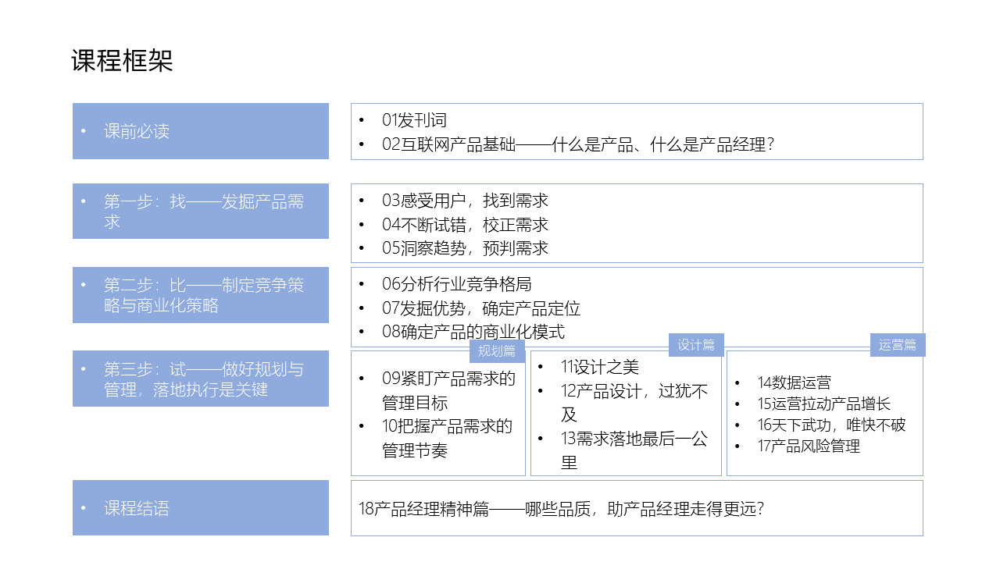

# 01 发刊词：产品能力人人必备

你好，欢迎来到《腾讯产品18讲》。 

正式学习开始前，先给你讲两个腾讯产品的故事。

第一个故事是这样的。腾讯内部有时候会举办各种产品投票，在一次票选【员工心中最需要改进的产品】活动中，QQ浏览器排在了第一位。

现在给你3秒钟想想，如果你是这个产品的产品经理，会怎么办？

几天后，腾讯内部BBS上出现了这样一条帖子：QQ浏览器重金邀请同事们内测，团队郑重承诺：请大家尽情吐槽浏览器的所有问题，保证100%及时回复，每48小时公开处理结果。

就这样，产品经理们收到了1130条反馈，归整为606类建议，团队马不停蹄开展了10轮讨论，在15天内完成了72项体验优化，推出了CE优化版。部门总经理逐字逐句修改内部CE的邮件，最后还在200多张致谢卡上一一签名。

3年后，作为业界有口皆碑的浏览器，QQ浏览器获得了“名品堂”奖项，这是腾讯奖励给优秀产品的最高荣誉。

第二个故事，和小马哥有关。QQ邮箱在腾讯被称为“七星级邮箱”，直到今天，《打造七星级邮箱》这门沉淀团队产品方法的网课，仍然是腾讯内部产品经理们最津津乐道的必学干货之一。

QQ邮箱被广泛称赞“快速、清爽、体验好、功能强”，这款产品广受喜爱的背后，当然离不开产品团队的不断创新、匠心打磨；但你知道吗？作为CEO,小马哥也亲自深度参与了大部分特性决策，熟知QQ邮箱最细节的体验和设计，是产品非常重要的“设计师”。

他与团队来往讨论的邮件达到1000多封，包括交互与视觉设计、用户体验、需求发现和实现，甚至对button摆放在哪儿、字号用多大、字体用什么颜色、皮肤怎么排序、字母用大写还是小写等等细节，都有充分的思考和探讨。

今天，小马哥可能已经不会再像当年这么深度地参与一款产品的设计，但创始人对做产品这件事的热爱和投入，以及做产品的一些执念和坚守，比如“10-100-1000法则“、“Don’t make me think!”、“让功能存在于无形之中”……某种意义上，都会写入这家公司的产品基因，成为腾讯一批批产品经理学习、认同和坚持的东西。

除了这两个故事里提到的QQ浏览器和QQ邮箱，腾讯20多年来，陪伴过你的，应该还有QQ、微信、王者荣耀、微信支付、公众号、小程序、QQ音乐、全民K歌、腾讯视频、腾讯新闻、天天P图等各种各样的产品。

**《腾讯产品18讲》讲什么？**

腾讯为什么能做出这么多产品？腾讯的产品经理们又是怎样做出这么多用户在用的产品？

往大的方面说，腾讯做产品，认同什么？坚持什么？

往小的说，腾讯做产品，有哪些方法和工具？具体说来，腾讯的产品经理是如何观察和研究用户，收集和分析需求的？面对激烈的市场竞争，如何巧妙地找到破局点和产品定位？面对来自用户、老板、合作伙伴方方面面的需求，哪些做，哪些不做？先做什么，后做什么？又是如何协同设计、开发、测试等不同岗位的同学，把那个最初的idea从脑海里、图纸上，变成一个真真切切能提供价值的产品？产品上线后，又如何不断运营迭代，获得更多用户，获得他们的长久忠诚？

往深处说，在这些做产品的理念与方法的背后，腾讯又是如何培养产品经理的？对他们的能力、素质乃至价值观，都有什么样的要求？

现在，《腾讯产品18讲》试着把对这些问题的思考做一些整理，观点不一定都对，但希望能和你交流探讨、互助互益。

在这里要强调一下，腾讯的产品类型众多，而过往20多年来，相对来说，在TO C产品上走过的路更长，经验积累更多，所以，这门课程整理的更多是在TO C产品上的一些工作思考。

**整套课程以5大模块、18节课程展开：**

第一模块除发刊词外，导入部分，将和你聊聊产品、产品经理这两个贯穿全课的关键词，建立基础共识；

如果一定要高度概括腾讯产品经理从0到1做产品的方法，我们可以简化为三步：**找——比——试**。**找，多方挖掘，找到需求；比，对比环境和自身，确定产品策略；试，快速尝试，实践才出真知**。

所以接下来第二到第四模块，将分别围绕这三步一一展开：

第二模块第3-5节课，讲第一步——找，腾讯的产品经理是怎样发现用户需求的？如何确定这就是真实的用户需求，逃出“伪需求”的魔咒？又如何洞察趋势、预判需求呢？

第三模块第6-8节课，讲第二步——比，腾讯的产品经理如何对比市场环境，识别自身的优势，从而确定合理的产品定位？又如何制定长远的商业化策略，让产品持久发展？

第四模块第9-17节课，讲第三步——试，腾讯的产品经理如何规划需求、设计产品，将头脑中的idea真真切切地实现出来，并通过合适的运营手段，让产品得到更多用户的使用和喜爱？这个过程中如何优雅尝试、高效迭代，在实践中出真知？

“找-比-试”这个三步法，是便于简化和理解腾讯产品实践而总结出来的，你可以根据自己产品的特点，有选择性地学习。

最后，第五模块第18节课，是收官部分，课程将站在更高处去审视，在这么多产品方法的背后，产品经理究竟需要具备哪些品质，才能走得更远，做出更有价值的产品。

除了这18节课，在第二、三、四模块的结尾，课程还精心准备了避坑指南，基本都是腾讯产品经理们过往工作中的失败经历，希望能帮你少踩坑、少走弯路。

课程全景图：

**腾讯为什么要做这套课？**

说到这儿，你可能很想问，腾讯为什么要做这套课呢？听者又能从这里收获什么？

刚才讲到“找-比-试”的产品三步法，你或许会发现，好像也适用于我们去解决工作和生活里面临的各种各样的问题。举个例子，如何脱颖而出，在工作中获取认可？你也可以用这个三步法：

**第一步，深挖需求，明白这个工作岗位对你有哪些期望；**

**第二步，对比周围的环境，分析自己的优势，确定自己的职场策略；**

**第三步，不断用行动证明自己的价值，满足各方对你的期望**。

所以，这套课的听众，即使只是一个普通个体，学习完这个产品三步法，希望你也能像产品经理一样，对需求有洞察、对人性有揣摩、对环境有判断、对自身有认知、对终局有想象……用“找-比-试”的三步法，去结构化地解决困扰你的所有问题，把“自己”这款产品，打磨得更好。我们相信，当这个社会里的每个普通个体都变得更好，社会才会变得更好。 

而如果你恰恰是一名产品经理，一定背负着这个瞬息万变、后浪不断赶超前浪的互联网行业里职场生存和自我成长的沉重压力。腾讯整理这套产品方法，希望与百万同你一样的产品经理们交流，如果你入行不久，希望这些腾讯产品方法，能帮你更快更好地入门；如果你已经是资深人士，希望这些腾讯产品案例背后的纠结与思考，能给你的工作带来一些新启发。我们相信，当互联网行业千千万万的人变好了，这个行业才会变得更好。

最后，如果你是传统行业的一员，在互联网下半场，我们一定会在行业融合中相遇，了解彼此的思维模式和做事方式就显得非常重要。腾讯希望通过这套课，尽可能完整呈现产品思维、互联网思维，供你了解。我们相信，加速、加深行业间的融合，生态才会变得更好。

一套课，如果能让互联网行业变好一点儿，生态变好一点儿，社会变好一点儿，这何尝不也是一种“科技向善“呢？

**这门课，你需要怎么学？**

为了把这套课做成，两年前，项目组就在腾讯内部精心挑选了多位无论在业务一线还是产品方法沉淀上都非常资深的专家和骨干，组成了课程开发小组。大家在繁忙工作之余，利用晚上和周末的休息时间，一方面，提取腾讯产品经理培养课程中的精华；另一方面，全新构建和打磨，访谈产品团队超过了20个，提纲迭代了16版，逐字稿反复修改超过30万字。

大家以满满诚意奉上这套课程，也希望你能做到这两点：

第一，分享：这套课不是绝对完整、正确的方法论，却是腾讯产品经理们做产品时的思考和总结。希望你能做到两个分享：一是分享自己的看法，大家互相交流，在每节课的最后，都留有一道思考题，欢迎在高手云集的评论区，互相过招；二是把这套课分享给你身边的朋友，让更多人加入到这场产品的大讨论中，互助共赢；

第二，实战：学以致用非常重要，这套课会以腾讯的产品实战案例为主，理论为辅；也希望你能将自己代入到案例故事的背后，去思考每个关键决策点背后的why与how，更希望你能将学习的收获，应用到你的工作中，这才是学习这门课的意义。

接下来，就让我们开启这段9周的学习旅程吧，期待你的收获！