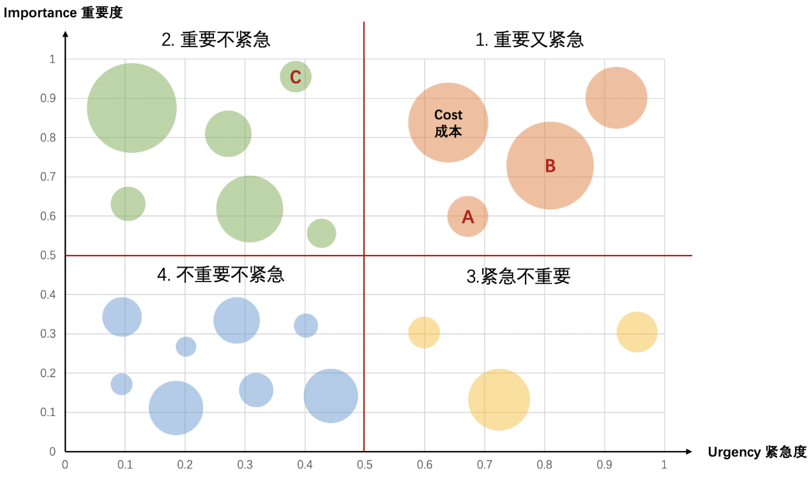

# 10 把握产品需求的管理节奏

你好，欢迎来到腾讯大学出品的《腾讯产品18讲》。

上一讲，我们讨论了做好需求规划，关键在于**回归到用户价值，围绕所定义的问题，展开三步法——锚定目标、围绕目标多角度判断需求价值、基于目标制定Roadmap。**

如果把需求规划的过程比喻成一首交响乐的诞生过程，可以说，需求规划做完，就类似于交响乐已经谱好，有主旨、有基调、有乐章的分割、有各乐章的主题。

但同样一首世界名曲，在不同的乐团、不同的指挥家手里，为什么却能演绎出大相径庭的效果呢？我们认为很重要的一个原因是“节奏感”——一首乐曲在演绎过程中，会有自己的轻重缓急、起承转合、抑扬顿挫。简单来说，乐谱是死的，但演奏的人是活的。

类比到产品上，相同的需求规划，换不同段位的产品经理来主导，落地过程和结果质量也会不尽相同。换句话说，产品需求规划宏观上是静态的，而在具体执行中，微观上却是动态的。即便我们确定了需求规划的大框架，明确了大版本，也需要我们在执行过程中，根据多变的内外部环境，审时度势，准确优雅地踏准每一个舞步。

所以这一讲，我们就来聊聊“节奏”这个话题。

**快与慢的思考**

说起节奏，我们脑海里最容易冒出的两个词是“快”和“慢”，那么在具体需求行进的过程中，到底什么时候该快？什么时候该慢呢？这里给你总结成两句大白话：

**第一句，该快的时候必须快。**

互联网江湖，唯快不破，产品经理对需求的敏感与执行需要非常敏捷，时刻扫描市场，一旦发现战机，立即决策、马上落地。

我们来看一个“唯快不破”的案例。2017年9月13日，苹果发布了新一代的旗舰机iPhone X，有一系列革命性的软硬件功能，其中一项叫“3D AR”。有点小意外的是，发布会上，天天P图作为国内首家适配iPhone X并搭载3D AR技术的图像软件，就以首批和iPhone X合作的自拍应用的身份，向全球媒体展示。

其实，iPhoneX 发布前夕，天天P图团队突然被苹果邀请，前往美国总部，希望能将P图的产品功能结合iPhone X的新特性进行突破性研发。当时团队面临的挑战是。这个邀请很突然，他们对iPhone X的产品能力了解很少，需要在极短时间内，思考出基于iPhone X的能力，P图如何在现有素材风格和效果基础上做出明显的产品突破。

团队成员开始迅速在网上找寻iPhone X的相关消息，任何角落都不放过。大家围绕收集到的信息，快速展开讨论，发现iPhone X的硬件特性能支持3D人脸建模，会使人脸检测更准确，也会使素材和妆容更精准地贴合。因此，团队想做出一些富有中国特色的妆容，比如中华戏剧脸谱，应该很有吸引力。除了效果好看，玩法也要新颖，团队就将戏剧脸谱和川剧变脸的玩法结合起来。

就这样，基于iPhone X前置摄像头能力，富有中华特色的“戏剧变脸”玩法诞生了。随着iPhone X火爆上市。这项新功能也引发了大量关注，用户量和市场影响力都得到了快速提升。

这个案例让我们看到，在常规的版本迭代过程中，一旦出现计划外的“战机”，就必须紧紧抓住转瞬即逝的窗口，快速响应、加速创新、敏捷落地，往往能取得事半功倍的奇袭效果。正如乐曲常规旋律行进中的明快变奏，常常让人眼前一亮，增强了乐曲的活力和感染力。

**第二句，慢，也是为了快。**

讲完了“快”，我们再来看看什么时候该“慢”呢？虽然我们反复说互联网需要“唯快不破”，但有些情况下，也需要压一压速度。比如产品特性变化很大，可能会对用户习惯和行为模式产生重大影响，或者影响的用户范围会很广，或者可能造成重大口碑风险等等。在这类需求的执行落地上，必须慎之又慎，否则一有闪失，可能就会前功尽弃，最终欲速则不达。

我们再来看一个案例。2018年，腾讯视频经过三年高速增长后，已经建立起完善成熟的会员体系，会员整体保持着较好的付费习惯和忠诚度。由于视频市场日趋饱和，已经进入存量市场阶段，进一步为会员提供更高阶的增值服务，以满足商业化演进的目标，成为了团队需要考虑的问题。但是，高阶产品定价是一个比较审慎的操作，对于上亿付费用户的影响是很大的，风险也不可预知。如果短时间内全面铺开，一着不慎，将引起巨大的用户波动甚至口碑风险。

经过反复斟酌讨论，团队确定了“局部灰度、小步慢跑”的产品节奏，选择在“用户规模可控、收入水平适当、影响风险较小”的城市，进行会员价格变动的灰度测试，并根据实际情况动态优化产品和节奏。基于这个原则，团队选取了在某沿海二线核心城市展开了产品灰度测试，密切关注各项指标，如付费用户增长流失率、DAU、付费收入等的变化，以及用户反馈和舆情口碑，在过程中指导优化付费特权的组合、动态调整定价。最终，产品灰度积累的数据模型和方法论，成为了后期全面加速推进会员特权产品量价齐升的重要参考，为之后视频会员产品的良性快速发展打下了基础。

**重要与紧急的思考**

说完了对快与慢的思考，我们再来谈谈对重要与紧急的思考。从大量的实战案例中，我们总结发现，决定产品需求节奏，很重要的方法是——**找寻“重要性”、“紧急度”与“成本”三者的平衡** 。换句话讲，决定节奏快慢的，就是这三大要素综合评估的产物。

我们来直观感受一下什么是“重要性”与“紧急度”。举个例子：修复产品Bug的需求，相对于用户重要建议的需求，哪个更急迫？Bug（产品错误与漏洞）会影响用户的正常使用，即使看起来不大的Bug，都有可能产生连锁反应，变成大Bug，导致严重的用户体验问题和口碑风险。比如一个小的登录密码校验漏洞，就有可能被黑客利用，演变成重大事故。而Issue (线上问题与反馈)可能是产品运营过程中，用户主动建议或被动发现的产品缺陷，大多Issue可能有损体验，但未必致命，比如用户抱怨注销按钮隐藏太深，不容易找到，虽然也可能会涉及到投诉，但对整个产品主干没有影响。因此，在成本可控范围内，通常Bug的重要性和紧急度，都要高于Issue，Bug类需求就要快节奏推进。

面对一大波需求，怎样更高效地快速评估节奏呢？这里，我们介绍一个简单实用的方法工具——UIC综合评估法。这里的U，是紧急度(Urgency)，I是重要性(Importance)，C是成本(Cost) ，基于这三个元素，我们可以构建一个四象限决策模型。你可以打开文稿，看到这个象限图。

在这张图里，横轴代表需求的紧急度，纵轴代表需求的重要度，以此形成四个象限：重要又紧急、重要不紧急、紧急不重要、不重要不紧急。我们还引入了另外一个比较重要的变量——成本，也就是你在图里看到的大大小小的圆圈，圆圈越大，表示需求实现的成本越高。

当我们拿到一波需求集合后，可以结合前面所学的方法，比如运用上一讲里“价值评估模型”，给各个需求的重要度打上价值分，归类到重要性的打分范围内；再利用“节奏评估原则”，归类到紧急度的打分范围。这样，就可以在四象限图里，清晰直观地看到各个需求的分布情况了。

那么对于同一象限内的A需求和B需求，要先做哪个呢？很明显，A的实现成本比B少很多，意味着占用资源少，协调到位快，所以先做A并加快A的节奏是最佳策略。同理，虽然“重要不紧急”象限的总体优先级理应低于“重要又紧急”象限，但由于需求C的重要性评分特别高，实现成本又特别低。因此我们常常会把C提前，快速落地。

所以你看，需求规划的节奏，一定是动态灵活控制的，才能取得事半功倍的效果。

讲到这里，我们还想多谈两句工具与人的关系。可以看到，UIC模型以及之前介绍过的许多产品方法和工具，都是前人总结提炼出的非常好的东西，可以让我们做产品更科学、高效。但请务必记住工具是死的，人是活的。这些工具方法需要产品经理不断根据实际情况来活学活用、敏捷迭代、与时俱进。真正好的产品经理，不仅有开阔的产品思维、严谨的产品逻辑，更有产品实战中的节奏感和应变把控力。这也是“产品感觉”的重要组成部分。

**总结**

好了，以上就是今天的课程。这一讲，我们主要谈到的是，确定了需求规划的大框架，明确了大版本后，也需要产品经理在执行过程中，根据多变的内外部环境，审时度势，准确优雅地踏准每一个舞步，踩准节奏。

具体来讲，该快时一定要快，产品经理要对需求的敏感与执行非常敏捷，时刻扫描市场，一旦发现战机，立即决策、马上落地；而慢，也是为了快，在一些特殊需求的执行落地上，必须慎之又慎，否则一有闪失，可能就会前功尽弃，最终欲速则不达。

决定产品需求的节奏，我们还介绍了一种方法——找寻“重要性”、“紧急度”与“成本”三者的平衡 ，并介绍了一个简单实用的方法工具——UIC综合评估法。

**课后分享**

这一讲的思考题是，请你应用UIC模型，复盘你自己的产品，找出其中“唯快不破”与“慢即是快”的需求点。

**悬念预告**

讲到这里，“找-比“试”三步法中“试”这一模块的规划篇，就要接近尾声了。在规划篇里，我们把产品经理比作作曲家，把产品规划管理比作谱写乐曲，把落地的动态规划过程，比作乐曲演绎。现在你有没有体会到，做产品也是一门艺术呢？

下节课，我们会进入“找-比-试”三步法中“试”这个模块的设计篇。请继续收听《腾讯产品18讲》的第11课《产品设计之美》。

恭喜你又学完一节课，如果你觉得有收获，别忘了分享给更多的朋友，共同成长进步。