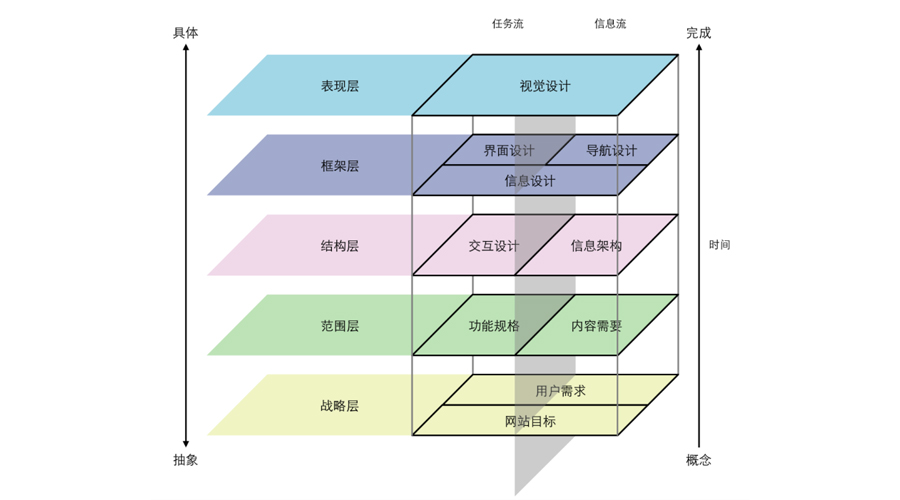
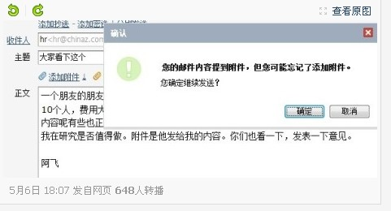
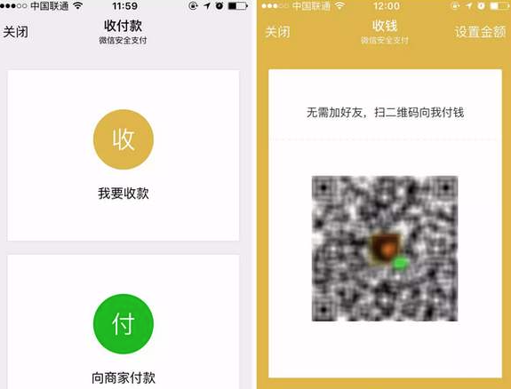
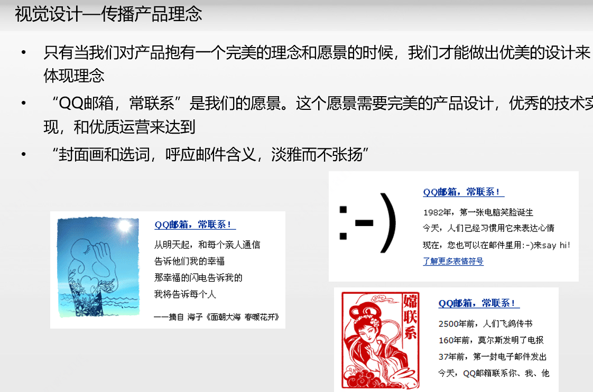

# 11 产品设计之美

你好，欢迎来到腾讯大学出品的《腾讯产品18讲》。

为了帮你更好地理解做产品的脉络，我们给你推荐一本产品经理必读书——《用户体验要素》，它介绍了一套产品设计的思维方式：**一个产品是由战略层、范围层、结构层、框架层和表现层这5层组成。**你可以打开文稿，看到这个模型。

前面10讲，我们带你研究了用户需求，分析了市场机会，瞄准了商业目标，找到了定位打法，你可以理解为我们做完了**战略层**要考虑的事；紧接着，我们又带你对产品需求进行了拆分细化和优先级排序。这也就完成了**范围层**要考虑的事。

这一讲，我们将带你进入这个模型的另外3个层次——结构层、框架层和表现层，交流一下产品经理在交互设计、界面设计和视觉设计上需要掌握的准则，打造出不仅简单好用，而且还有个性的产品，让用户感受到共鸣和愉悦。

说到这里，有的产品经理可能会问了：交互设计、界面设计和视觉设计。这不应该是设计师的事儿吗？我为啥要学这个？

还记得早年微博上设计师们疯传的吐槽段子“给我一个五彩斑斓的黑”吗？产品经理掌握基本的设计知识，至少首先能保证和设计师们在同一个认知水平上对话，能提高合作效率；再往深的说，产品经理为最终产品的用户体验负责，张小龙给腾讯产品经理分享过一个观点：你的产品的美感，不会超过你的审美能力。所以，作为产品经理，你非常需要掌握设计的一些基本原则。

今天，我们就来聊聊产品设计非常重要的一个原则——**“人是设计之本”**。

**人是设计之本**

腾讯的经营理念是“一切以用户价值为依归”，在产品设计上，我们也倡导以“人”为本。小龙还有一个设计理念是：不以设计为导向，以用户为导向；没有设计，只有解决问题。

“人是设计之本”这个命题非常宏大，有很多经典的设计理论可以进一步学习。今天这一讲，我们将用灵魂3问，带出几个我们认为非常重要的设计理念，帮助你更容易理解以人为本的设计。

**第一问：你的设计，都是用户真正需要的吗？**

**我们提这个问题，对应的设计理念是“少即是多”。**早年间，小马哥给腾讯产品经理分享他的设计理念时就说过：“ 用户价值不会因为是统一了（大而全）而体现的，而是每一个单项是否能真正赢得用户的喜爱。‘简单’的核心在于，做好最核心的10个，放弃其它的90个。”“做得越多越不好，我们需要经常告诫自己，是不是做得太多了？”

怎样做到“少即是多”呢？首先，你得学会砍需求，除此之外，寻找方法，优先解决多样用户的共性需求最为关键。在小龙看来，对系统的抽象认知能力，可以让产品经理很好地把握用户的需求，扩展产品的想象边界。通过分类，让复杂的东西变得更有条理；通过抽象，找到复杂东西的共性，解决共性问题，就可以让产品化繁为简。

给你举个例子，微信的功能再怎么多，可底部永远只有四个Tab。这就是微信作为一个“通讯工具”提供的最基础最稳固的用户价值，虽然它的功能早已远超这个基础定位。

说到这里，可能有些人会说。这就是大家都知道的“less is more”嘛。是的，道理大家都懂，但今天，我们也看到越来越多的产品，因为要满足公司的商业目标，要满足老板的需求，要考虑各种干系人的利益……产品设计越来越复杂，反倒是远离了用户，背离了初心。

所以，和设计师一起，开始设计前，请使用“最强整理术”，让自己变成用户，对功能列表进行一次全面的断舍离吧。建立产品框架，保持主干清晰，枝干适度，简单明了，把次要的功能隐藏在二级页面，尽量让用户在一个维度里解决具体事情。

**第二问：你的设计，用户能懂吗？**

**我们提这个问题，对应的设计理念是“符合用户的习惯和预期”，保持体验自然。**在第三讲，我们聊过“秒变白痴”理论——产品经理要不断修炼，能让自己变成一个迟钝、挑剔、易怒的傻瓜，快速get用户的习惯和预期，从而降低用户的理解成本，快速上手使用。

怎样能让产品设计符合用户的习惯和预期呢？可以从这3个方面着手：

首先，请遵从自然、遵从习惯、遵从规律。比如用户一般习惯用右手操作，习惯从左到右阅读，所以一般将按钮摆放在界面的右边；比如用户对红色会产生警戒心理，所以在产品设计上，红色只用在严重错误或警告中，禁止用来吸引眼球；又比如产品设计要尽量与操作系统习惯保持一致，不要反规则……符合用户自然操作的最伟大设计之一，就是iphone的创新，脱离了键盘，用手指完成屏幕交互，所见即所得，连三岁的娃娃都会用！ 

第二，帮助用户避免错误。自然的场景帮助用户避免问题，不仅可以推动功能的进一步普及，也有可能会成为用户津津乐道的小惊喜。比如，用户使用QQmail，如果在邮件正文里提到“附件”，但在发送时并没有粘贴任何附件，那么系统会立即提醒：您是否忘了加上附件？

最后，保持界面的统一，尽量与操作系统习惯一致，不要违反规则。统一的界面可以减少用户的熟悉和理解成本，而多种表现容易让用户迷惑。一个产品中，每个界面只有一个主题，尽可能用标准界面，尽可能只有一种字体，一类控件，一种式样，一种背景……

说完这些，你可能还是有点困惑。不要紧，接下来，我们给你举个微信支付收付款功能迭代的案例，帮助你更好地理解。

微信支付收付款功能上线的初期，大量的用户和商家都在学习这个功能，经常出现搞错了收款和付款二维码而导致纠纷的情况。由于支付是一个用户高敏感度的行为，使用过程出错，会带来非常差的用户体验，甚至造成很恶劣的影响，所以，这个功能的设计优化，就非常重要了。

微信支付的产品团队是怎么做的呢？

首先，先分析产品面向用户的服务路径。收付款功能面向了收款方和付款方两类用户，其中收款商家通常会将“收款二维码”打印粘贴在店面里，一般仅需生成一次；但随着移动支付场景越来越广泛覆盖，付款比收款使用频率高多了。

所以最新的方案，团队优化了功能操作路径，将更常用的付款功能作为主路径。当用户点击收付款功能入口，默认直接展现“向商家付款”的付款功能，同时下方也提供 “二维码收款”的功能入口。

我们将这个设计优化前后的截图放在了文稿里，你可以仔细对比看看。

【修改前】

【修改后】

除了优化收付款功能界面的设计，产品团队还考虑了更多：比如，向商家付款的二维码，如同信用卡一样，手机截屏等操作都会带来二维码传播，导致盗刷。为了避免用户受到损失，当用户首次使用付款码时，产品加强了用户教育，通过隐藏付款码数字、禁止付款二维码截屏等多种方式，悉心保证用户的财务安全。

**第三问：你的设计，用户会一直喜欢吗？**

如果说前两个问题，都是在设计产品的体验，聚焦在产品的可用性、易用性层面；那么这个问题，就是在设计产品的情感，聚焦在产品能否给用户带来愉悦。

**我们提这个问题，对应的设计理念是“产品也是有个性、价值观的，需要让用户感到人性共鸣”。**就像喜欢一个人，始于颜值，敬于才华，合于性格，用户喜欢一个产品也是这样。当产品经理赋予产品以理念和愿景时，产品就有了自己的个性和价值观。

举一个例子，“QQ邮箱，常联系”是这款产品的愿景，体现在产品设计上，无论是封面画还是选词，都在呼应这个愿景，比如封面用大海，选词改编了海子《面朝大海 春暖花开》的诗句，“从明天起，和每个亲人通信，告诉他们我的幸福”，整体设计淡雅而不张扬，具有美感。你还可以打开文稿，看到QQ邮箱更多这样的设计。

我们可以看到，在理性的产品中，添加一些人文的元素，把产品的所有脉络连接起来，能让产品具备灵魂。但需要注意的是，人文元素一定不是主体，不能过于放大；它更多的是体现在不容易看到的地方，比如产品文案。文案是产品经理在和用户说话，非常能反映产品的气质。举个例子，微信和用户的关系非常平等，像朋友一样，既不抬高自己，也不讨好和勉强用户。因此，微信的文案，从来都用“你”而不是“您”，从来不用“还不邀请朋友”这种勉强用户的句式。 

最后，我们还想强调一个设计理念——细节决定成败。这个理念是贯穿在产品设计全程的。小龙就倡导，产品经理要像工匠一样打磨每个设计细节，每天要优化10个自己和他人在产品使用过程中遇到的不便的地方。

**产品经理如何修炼设计力？**

聊完“人是设计之本”这个原则，介绍了这么多设计理念，你肯定很想问，那我平时应该怎么修炼，才能做出好的产品设计呢？这里我们也给你“三多”建议：

**第一，多看、多感受、多体会**

熊本熊的设计师水野学曾经说过：“我认为‘感觉’是知识的聚集，学识越广博，越是能衍生多样的可能性，知识如纸，‘感觉’如画……过去的积蓄，即你所掌握的‘不惊人的东西’越多，创意的土壤越广。”

多看世界，感受生活中的美，美的风景、美的动物、美的色彩等等；

多看优秀的设计作品：比如逛博物馆，看设计展、古典艺术品展，多看流行作品，比如国外主流APP的设计，体会经过时间沉淀的美，也了解现代变化和流行趋势，体会简洁之美、现代之美、科技之美、智慧之美。

**第二个建议，多做、多思考。**

无论是感受生活，还是体会作品，重要的是看完后，能动手实践，练习创作自己的作品，并持续打磨。这个作品可以是一个流程、一个交互、一个美术作品、一个手工、一个模型……

除了实践，还要养成思考的习惯，比如在小店排队，主动思考如果自己是老板，会如何设计排队流程，提升效率，同时避免漏单和漏收银的情况，可以将这些建议反馈给店家。这些思考和建议哪怕每次只进步一点点，但带来的成就感和生理记忆都是无可取代的。

**第三个建议，多洞察人性。**

人性是复杂的，真善美和贪嗔痴夹杂，优秀的作品，往往能寻找到心灵共鸣，好看的设计、有趣的设计、充满爱的设计，戳中用户的泪点笑点。这才是我们需要的激荡人心的作品，而非仅仅满足需求的作品。

我们在第3讲《感受用户，找到需求》里介绍了4种方法，培养产品经理的共情力，同样也是极好地训练自己观察人的方法，大家如果忘记了，可以复习一下，练习起来。

**总结**

这节课，我们探讨了产品经理在交互、界面和视觉设计等具象化产品设计过程中，需要了解的很重要的一个设计原则——人是设计之本。

产品经理需要常常对自己进行灵魂三问——用户需要吗、用户懂吗、用户会一直喜欢吗，不断实践这几个设计理念——少即是多、符合用户的习惯与预期，打造产品的个性和价值观。

功夫在诗外。产品经理日常还得多看、多感受、多体会、多做、多思考、多洞察人性，不断修炼自己的设计功力。

只有做到这些，产品经理才能设计出更简单易用的产品，让用户更愉悦的产品。

 **课后分享** 

这一讲的最后，留给你的思考题是：有没有什么好的产品设计，让你感受到了以人为本？欢迎在留言区与大家分享；关于产品你还有哪些问题，也欢迎向腾讯产品专家提问，主讲老师将回复你的问题。

**悬念预告**

明确了重要的设计原则和理念，那么下节课，我们将继续探讨，在具体设计的过程中，有哪些需要特别注意的地方，能让我们少走弯路？

请继续收听《腾讯产品18讲》的第12讲《产品设计，过犹不及》。恭喜你又学完一节课，如果你觉得有收获，别忘了分享给更多的朋友，共同成长进步。

