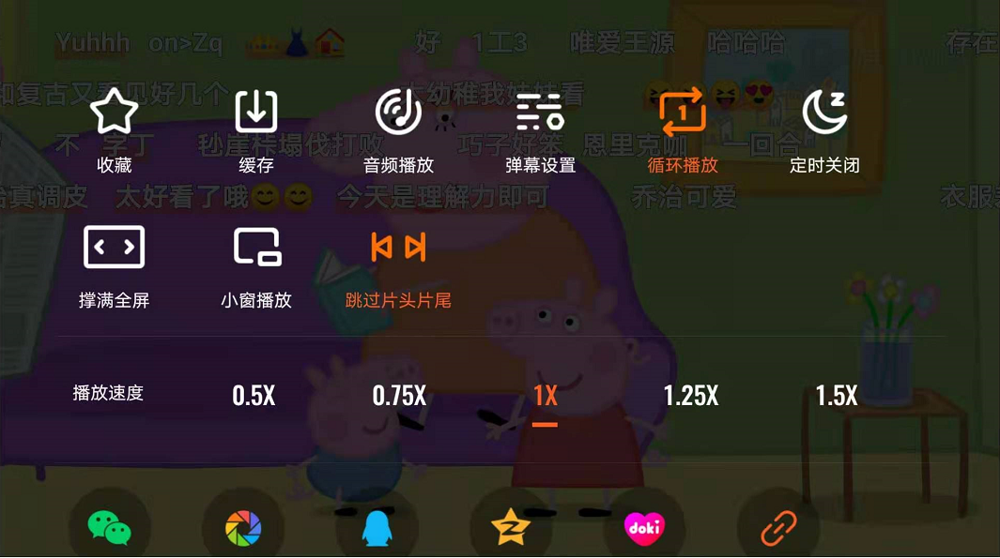

# 13 需求落地最后一公里

你好，欢迎来到腾讯大学出品的《腾讯产品18讲》。

上一讲，我们学习了产品需求设计的基本原则，产品经理需要面向用户实际的使用场景，弄清楚我们正在解决什么用户，在什么地方，遇到的什么问题，并建立从基础到高级的需求模型，优先保障可用性，不断优化体验，之后再扩展更多用户群，放大影响力，实现业务生态布局，从基础到高级依次向上满足。

今天这一讲，我们将继续讨论，这些对用户有价值的需求，应该怎么落地，以及如何检验这些需求满足了设计的初衷。

**品质决定资源投入——用流程机制为长周期产品的落地保驾护航。**

首先，我们来看长周期产品。用一句话总结：品质决定资源投入——用流程机制为长周期产品的落地保驾护航。

互动娱乐事业群（简称IEG）作为腾讯最成功的BG之一，陆续推出过许多用户喜闻乐见的产品，并且多数产品都能保持较高的质量水准。这背后有什么诀窍吗？通过什么办法，能让产品品质都实现80分以上呢？Gate Review（简称GR）评审，就是IEG取得成功的一个重要方法。

GR是一套产品制作立项的评审帮助流程，由各方具有丰富经验的专家们，在产品研发生命周期中的关键评审点，全方位给予项目组各方面的指导。GR评审从最初的创意到产品正式对外发布，一共分为5个步骤，从GR1到GR5，只有通过每一轮GR评审的产品，才可以进入到下个阶段，并获得匹配的资源投入。GR作为制度和流程的保障，为IEG的项目保驾护航，合理分配资源，并可以把一些明显劣质、不适合的产品从流程中剔除掉，从而缔造精品。

下面，我们来看一下GR评审的流程：

1、GR1又叫Concept（概念）阶段，团队在这个阶段需要**筛选和提炼产品的核心概念**，同时，需要关注市场分析、用户定位、用户体验和产品风险等方面。这一轮评审的目的是：产品创意符合当前形势，并能使组织在可预见的未来，获得进一步的（或可持续的）成功。如果GR1顺利通过，将组建项目核心小组，启动筹备工作。

2、GR2的关键词是 Prototype（原型），项目筹备小组在此阶段需要**开发产品原型**，验证技术风险，通过真实的美术资源确立美术风格，同时确立产品特性优先级，确定项目计划和资源计划。这一轮评审关键，是判断在GR1的基础上所开发的产品雏形，是否符合预期，同时由各领域专家对项目的策划、美术、程序、计划等各方面进行深度诊断和分析，给出专家意见。如果GR2顺利通过，意味着项目立项，将由HR发文，正式成立项目组。

3、项目组在GR3评审前，需要**完成可验证核心玩法的试玩版本**。试玩版本需要体现产品核心概念，并达到面向市场的品质；完成量产工具和制作流程的准备；细化项目计划、资源计划，刷新后续工作量和CP计划。如果GR3通过，BG将投入资源开始大规模量产。需要关注的是，产品立项和开始大规模量产属于IEG的重大业务决策，为了避免投入较多资源后再推倒重来的情况发生，需要及早确认和验证技术风险，确保直接关系到产品核心特色、玩法亮点的开发目标能被顺利达成。

4、接下来，将**投入大量项目资源进行量产**。项目组在此阶段要完成产品的全部开发，并逐步开启封测，通过用户反馈，验证和打磨产品品质。如果GR4通过，进入Beta阶段，决定项目可以开启内测。

5、Beta阶段：项目组在此阶段进行反复内测，验证和打磨产品品质，**进行上市前的最后Check**。团队每月对产品运营数据指标进行评测，在经过一段时间的内测后，项目组才可以申请进行GR5。GR5要看产品的各项数据，特别是有效留存，将直接决定产品的定级，也决定了产品能获得的各项资源。如果GR5通过，意味着项目终于可以正式对外发布，开启公测。

腾讯高级副总裁马晓轶在接受《腾讯月刊》采访时说过：“我们观察过所有的项目，发现最浪费的时间是来回折腾。为什么大量的项目花了很长时间，甚至三年五年？如果一个项目的开发时间超过了四年、五年，一定是在中间改变了它的方向，就是做到一半觉得不行，这个方向看来是不对的，或者这个功能当初想得很好，但是发现技术上是不能实现的，或者其实和其它的功能是有冲突、有矛盾的，没法做下去了，或者市场已经变了……最大的浪费是在这个点上。所以，事先我们要求一定要先把文档写好，你的Concept（概念）是怎样的，你要做一个Prototype（原型）出来，你的原型能够验证你的Concept（概念），你要做好最核心的Feature（特性），能够确保这些Feature技术上可实现，拿出来也很好玩，我们才允许你做全面铺开的产品，看起来是浪费了很多时间，但是这样真的是减少了你后面反复的时间。我们最怕的就是你拉了一百个人，做了一年之后发现这个功能看起来是有问题的，我们需要推掉重新来做，这是最浪费时间的。看起来是前面浪费了很多时间，但这是为了后面不浪费时间，风险降低太多了，这点时间是值得的。”

随着移动客户端APP、H5、小程序等产品新形态的涌现，IEG也推出了更加轻量化的流程规范，以匹配和适应新的产品形态，但在它们背后，把控方向、控制资源投入以及预防风险的指导思想，始终是没有变的。产品评审流程的所有努力，都是为了让“产品品质决定资源投入”这一原则深入人心，通过流程机制，倒逼团队更有动力打造精品、为用户创造价值。

**短周期产品：在不断试错中验证对用户的猜想**

我们讨论了对于长周期产品，可以通过阶段性的评审把关，减少执行落地过程中的风险。那么对于短周期，或者已经发布上线正在迭代优化中的产品，对应的需求应该怎么落地，以及如何检验我们所实现的需求，都满足了设计的初衷呢？

用一句话回答：**在不断试错中验证对用户的猜想。**具体如何试错，这门课的第4讲《不断试错，校正需求》给出的四条秘方，同样适用于这里，现在我们一起再来回顾下。

**第一条秘方：引导发声。**

产品策划之初，我们需要聆听用户心声；产品上线之后，我们更需要获取用户使用后的反馈，来验证曾经的想法，或者发现新的问题。所以我们一定要创造足够多的渠道和通路，让用户更愿意、更简单地发声。

**比如，在产品之外，组织用户群进行自由交流。**

推荐大家使用1对1、或者3-5人的小群方式与用户交流，人少，沟通可以比较深入，也因为具有一定的私密性，用户会更自然地吐露自己的心声。“听其言，观其行”，除了听用户怎么说，产品经理也可以邀请用户参加线下的体验活动，现场观察真实的用户实际上是怎样使用产品，还可以使用眼动仪等专业设备来监测是什么吸引了用户的注意力，用户在什么地方停留时间比较久，又在什么地方感到困惑，往往会有意料之外的发现。

**又比如，在产品之内，设计契合用户场景的发声通路。**

在产品中规划用户反馈意见的入口，应该是大家普遍的常识。但常常被忽略的是，在用户受阻场景中设计适合的发声通道，比如在用户播放视频卡顿时，能出现播放异常反馈的入口，此时系统可以收集用户的网络环境、观看内容、故障时间等，为故障判断做一定的参考；又比如在外卖订单中，我们可以看到一些「催单」功能的设计，当用户等待时间过久，已经超出等待耐心时，可以让用户非常方便地表达诉求。这一类型的用户反馈，融入到细节的产品设计中，既能让我们更容易定位问题，又可以在用户受阻路径中，帮助用户缓解和发泄受挫情绪。

**第二条秘方：灰度策略。**

灰度策略往往应用于新产品或新功能的尝试。通过向不同数量级的用户逐步开放，在过程中根据用户的反馈和行为数据，来优化调整产品细节。

灰度策略一般有三种方式，可以应用于不同的场景。

**1.** **随机灰度。**一般在发布适合全局用户的新功能或新特性时使用，也就是在全局用户中随机测试一批用户来观察效果。

**2.** **定向灰度。**它适用于在产品中根据细分群体去发布的一些新功能。就像前面课中讲到的QQ厘米秀的案例，就是巧妙地对目标用户群进行灰度，从而推广创新产品。

**3.** **邀请灰度。**它通常适用于一款新产品的诞生，并且具备一定的社交或社区属性。一方面，能在产品诞生之初，更加聚焦于典型的种子用户群体；同时，还通过邀请码的方式，让用户形成自传播，为产品带来自增流量和口碑效应。

**第三条秘方：善用实验**

通过A/B Test实验，可以同时对不同的图片、标题、按钮、样式，甚至不同的业务分支逻辑等进行不断尝试，找到最优解，通过数据驱动产品，帮助我们降低验证成本，快速达成共识，提升创新效率。

**第四条秘方：关注异常**

异常，意味着问题或机遇。对产品中的异常表现和异常数据，产品经理一定要保持足够的敏感度，它往往能够成为帮助我们挖掘新需求的起点。

腾讯视频的产品经理就曾经发现一些不正常的播放数据，比如有些视频的播放完成度居然超过百分之一百，仔细分析后才发现，绝大部分来自于动画片等少儿品类，原来是小朋友对一个内容喜欢重复观看；于是，团队针对少儿内容，做了循环播放功能，方便家长为孩子进行设置，更好地满足小朋友的需求。

腾讯敏捷开发的目标，在于快速验证我们对于用户的猜想，不论是灰度、实验还是关注异常，这里共同的前提，是需要保障关键数据的收集，在符合相关法规及保护好用户隐私的基础上，增加用户行为的监控埋点。用户所做的，往往比他所说的，更能代表他的真实想法，我们可以通过用户的操作步骤，来分析他们的实际想法，不断打磨和完善我们的产品。

**需求落地最后一公里**

讲完了长周期产品和短周期产品，在需求落地方面的注意事项。最后，我们聊聊在需求落地的过程中，除了要有流程机制和方向性的保障，以及不断迭代的意识来验证和打磨需求外，在需求真正发布前，还有哪些准备工作需要做呢？

首先，**要做好产品层面的准备**，确保功能实现符合预期，并且没有明显影响用户体验的Bug。作为每天都有数亿用户使用的产品，QQ在每次版本灰度之前，会组织一个Show Case体验会。在这个会上，QQ团队的GM（总经理）、总监，还有产品、设计、开发、测试等同事会一起来体验新功能，看新功能有没有一些特别的体验问题、可用性问题。同时，在发布之前，QQ会有各个角色的check list，由各个负责人进行最后的检查：产品经理确认是否都已经体验完毕，开发人员确认代码Review是否都已经OK，测试人员确认是否还有严重Bug，设计负责人进行UI视觉的走查。当这些检查全都结束，电子流走完了之后，QQ的新版本才会开始灰度发布。

其次，**要做好技术层面的准备**，做好性能和压力测试，根据新版本发布后可能的用户访问量、交易量，做好系统容量评估，及时对服务器、带宽进行扩容，避免热情涌入的用户把系统压垮。

再次，**要做好数据的准备**，避免因为前端上报或后端统计报表的缺失，无法及时监控产品发布后的数据表现，给运营和后续的优化造成被动局面。

最后，也是最容易被忽略的，**要做好运营和传播方面的准备**，需求发布前，准备好相关的公告及用户指引，提前与客服、PR等同事沟通对齐新需求的内容及可能造成的影响，输出话术和FAQ提前应对，并在发布后密切关注用户的反馈，以及各种媒体评论，避免用户投诉和舆论带来的风险。

**总结**

这一讲，我们分享的是需求应该怎样落地，以及如何检验我们实现的需求，是否满足设计的初衷。归纳起来，主要有这么几个观点：

首先，对于长周期的产品，可以通过评审流程机制和阶段性的资源投入，降低来自产品方向调整和技术实现方面的风险，避免来回折腾。

其次，对于短周期和迭代优化阶段的产品，需要关注用户反馈和系统异常，并通过灰度和实验，来验证我们对于用户的猜想，不断打磨和完善体验。

最后，在需求正式发布前，要在产品、技术、数据、运营和传播等方面做好充分准备，避免因一时疏忽，造成团队的努力“一夜回到解放前”。

今天这一讲，虽然标题是《需求落地最后一公里》，但其实，我们一直都不知道，什么时候是真正的最后一公里。产品经理需要永远保持如履薄冰和求真务实的心态，把控节奏、把控质量、不断校正和还原用户真正的需求，在被用户真正买账之前，在获得用户真正的认可之前，永远都是最后一公里。

**课后分享**

今天的课后题是：你在以往需求落地过程中遇到过哪些坑？再来一次的话，有哪些地方可以做得更好？欢迎你在留言区与大家分享。

**悬念预告**

讲到这里，“找-比-试”三步法中“试”这一模块的设计篇，就要接近尾声了。到这里，我们已经完整见证了一款产品从0到1的过程。下节课，我们会进入“试”这个模块的运营篇，看看产品正式发布以后，如何通过产品运营工作，帮助用户和产品建立关系，不断放大产品的价值。

请继续收听《腾讯产品18讲》的第14课《数据运营》。恭喜你又学完一节课，如果你觉得有收获，别忘了分享给更多的朋友，共同成长进步。