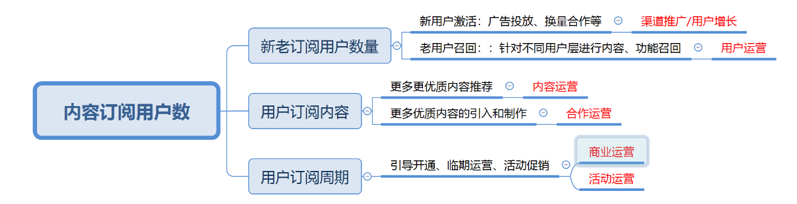

# 14 数据运营

你好，欢迎来到腾讯大学出品的《腾讯产品18讲》。

前面的课程，我们一起见证了一款产品从0到1的过程。业内有句俗话说：好产品是1，而运营是在后面不断加0，是变成10、100，还是1亿，都取决于运营做得好不好。从这一讲开始，我们就进入到“找-比-试”三步法中“试”这个模块的运营篇，用4节课聊聊，产品正式发布以后，产品经理应该如何找到用户，依靠各种运营手段，帮助用户和产品建立关系，不断放大产品的价值。

今天这节课，我们先来聊聊数据这件事。

在腾讯做产品，几乎每天开工第一件事，都是打开报表看数据；给老板汇报或者晋级答辩，产品经理最常被问到的，就是你的业务数据怎么样，你做了哪些事儿，让数据有所提升。

**为什么数据这么重要？** 每款产品的发展，都有自己的目标；为了监控这些目标的达成，会建立一系列的业务指标，所以产生了各种各样的数据。可以说，数据，是产品经理用来衡量产品业务发展的工具，有了它，大家对业务的理解和判断，才会有统一的标尺。

给你举个例子。同样是向老板汇报一场线下会展活动的运营效果，产品经理A说：做得很成功，现场人山人海。产品经理B说：从活动曝光人数看，这次我们覆盖了5000名用户；从拉新效果上看，给咱们的产品带来了1500人的使用激活；从投入产出比看，平均拉一个新用户的成本是50块。如果你是老板，你更倾向哪个产品经理的汇报方式？答案很显然是后者。

既然数据这么重要，在产品运营阶段，产品经理应该如何围绕数据展开工作呢？今天，我们就来聊聊数据运营的四步法。

**第一步，定义和拆解数据指标** 产品经理定义指标时，有个专有名词叫“北极星指标”，它是一个阶段内最关键的唯一指标，像北极星一样指引着产品前进，能反映产品经理对产品核心价值的追求。

举个例子：微信的北极星指标，某个阶段内，定义为每日成功发送的消息数，用来衡量微信作为一款通讯软件的生命力；腾讯视频的北极星指标，某个阶段内，定义为付费会员订阅数，可以衡量产品价值，也能反映营收业绩；你觉得Facebook的北极星指标应该是什么？如果定义为总注册用户数合理么？这里停两秒钟，你可以思考下（录制时停两秒）。总注册用户数其实是一个虚假繁荣指标，可能用户是好几年前注册的，但现在早已流失，无法反映产品真正的价值。所以，Facebook把月活跃用户数作为北极星指标。

在实际工作中，会有很多角色一起配合，来共同达成产品的北极星指标。这就需要根据不同分工，来进行执行指标的拆解。这也要求北极星指标要客观、简单，便于理解和拆解。

我们继续举个例子。某视频网站的北极星指标是内容订阅用户数，如何拆解成各个团队的执行指标呢？

首先，我们来看影响这个北极星指标的达成，都会有哪些因素。对于提高内容订阅用户数，一般可以拆解成三个方面：第一个是提高用户订阅数，第二个是提升订阅内容的吸引力，第三个是拉长用户订阅的周期。这三个方面其实还可以继续细分，以提高内容订阅用户数举例，我们又可以拆解为三个方面：第一个是新用户的激活，第二个是老用户的召回，第三个是体验或使用用户的转化。

我们给你做了一张图，你可以点开文稿，看看这中间的拆解关系。

类似这样的拆解，就为产品运营确定了工作目标，负责拉新、推广的同学能知道自己每天要拉来多少新用户，要保证新用户的质量，让用户有更多的留存。这样的话，既有眼前明确的小目标，能指导工作落地，又有大的、全局性的北极星指标，让工作方向明晰、有意义。

**数据运营第二步，找到合适的运营方法** 定义和拆解了数据指标，我们接下来需要根据不同的数据维度，找到相匹配的运营方法。

继续刚才的例子，北极星指标是内容订阅用户数，从不同的数据指标出发，就衍生出了不同的运营方法：比如，要提高新用户数量，得靠渠道推广、靠各种用户增长手段；而如果要提升用户订阅内容的吸引力，就需要内容运营岗位的同学想办法，通过合作、筛选、主题运营或者算法推荐，为用户提供更匹配、更有价值的内容；再比如，要拉长用户付费周期，就需要商业化的运营，包括定价策略、引导会员开通策略，甚至活动运营，也就是在一定周期内设置一些促销热点活动，从而加长用户的订阅周期。

总的来说，运营方式并没有一个绝对的划分标准，我们往往基于业务的核心目标，以及拆解具体的执行数据指标后，根据业务发展阶段和团队特点，找出当下运营的重点，从而确定具体的运营方法。

同时，需要指出的是，运营分工也在不断演进。比如过去拉新用户，更多属于渠道推广的工作，而现在，为了从拉新、到用户激活、再到用户留存、用户召回形成一体，许多公司会引入用户增长的理念，围绕这一目标，让产品策划、产品运营甚至技术开发同学，组建一个专门的小团队，来独立推进。

**数据运营第三步，分析和改善数据指标的完成情况** 有同学可能会问，我清楚了产品的北极星指标，也清楚了拆解后分给自己的指标，那过程中，我该如何判断这个数据是好还是不好呢？接下来，我就要讲两个非常实用的数据分析方法：**一个是漏斗分析法，一个是A/B Test**。

**漏斗分析法，简单来说，就是抽象出产品中的某一个流程，观察过程中每一步的转化和流失，锁定流失问题，并且有针对性地分析原因，找到提升办法**。

我们举一个【推送提醒更新的push给用户】的案例，当老板问你，这个事儿的数据怎么样，你说最终有20个用户点开了push，进行了升级。那这个活动效果到底好不好呢？我们就可以通过漏斗分析，拆解push的每个流程的转化和流失情况。

我们在文稿里插了一张图，把每一步触达用户的数据都列了出来，你可以看到每个环节的点击率分别是多少，从而发现漏斗漏得最多的地方在哪里，然后有针对性地去思考解决办法。

具体来说，这张图有两个地方流失率很大：第一个是从push下发到push曝光这个环节，只有20%的转化率，也就是说有80%的用户，是看不到push的。下一步我们就可以思考，为什么有这么多人看不到呢？可能会有哪些方面的原因呢？第二个流失率很高的环节是，看到push的人，只有2%点击了push。这就说明有98%的人，都对这条push不感兴趣。因此接下来，我们就要思考是什么原因，应该怎么优化？例如是push的时机不对吗？是文案不好吗？……

所以，你就可以这样回答老板的灵魂拷问：我们拆解了各个核心节点的转化，发现有两个环节表现不好，需要改善：一个是从push下发到push曝光，转化率仅20%，我们判断可能原因有这么几点……；第二个是从push曝光到push点击，转化率只有2%，我们判断可能原因是这么几点……因此，我们打算从这几个方面来提升运营效果。你看，这个分析是不是就很有理有据、清晰易懂。

接下来，我们再来看看第种二方法，A/BTest。这个方法我们在第4课《不断试错，校正需求》和第9课《紧盯产品需求的管理目标》都有介绍，我再帮你回忆一下。A/BTest设置一个对照组、一个实验组，对两组用户推荐不同的产品策略，来分别验证效果，验证可行后，再大规模应用其中更好的策略。

举个例子。我们做一个投放红包、拉新用户的运营活动，用户可以通过活动页领取1-10元不等的红包，页面下方会引导用户到APP上提现，从而达到拉新和拉活用户的目标。可以看到，页面下方的引导文案怎么写，就相当重要了。于是我们运用了A/BTest，做了两个页面，它们唯一的变量就是最下方的拉新文案不同：一个是立即提现，另一个是领取到账。我们通过系统进行小流量投放测试，来看哪一组的点击率更高，结果显示：“立即提现” 按钮点击率是62%，而“领取到账”的点击率是50%。这就说明“立即提现”的字眼更吸引人，于是我们就会将更大的流量，甚至全部流量都投放在这个“立即提现”的活动页面上。

这是最简单的例子。A/BTest的准确应用，还需要数据投放的平台进行支撑，这里就不做深入展开。感兴趣的同学可以专门去研究。

**数据运营第四步，做好数据导向的总结优化** 最后，我们来说说数据的**总结复盘**和**迭代优化**。这一点是对前面所有知识点的应用，也是非常重要的工作方法。怎么理解“总结复盘、迭代优化”这8个字呢？我们所有运营工作的目标，都是为了达成业务数据指标。我们拆解了数据指标后，制定执行策略，看数据分析效果，效果好，就要思考怎么扩大效果；效果不好，就需要定位原因，重新制定策略。而整个看数据、找问题、定位优化过程，就是总结复盘、迭代优化的过程。

我们画了一个迭代优化的流程图，插在文稿里，大家可以点开，更直观地看到这中间的流程。

举个例子。天天P图在一开始拉新用户的时候，策略是在QQ空间投放广告，运营目标是提升这款产品在QQ空间里的流量转化效率，降低拉新成本。产品团队发现蹭热点是一个很好的策略，广告点击率高，转化效果好。于是就持续加码，做更多热点。这就是扩大执行，放大价值。但是过了一段时间，再review数据时，会发现有些蹭热点的运营，虽然广告点击率好，但拉来的新用户，留存率很低，导致看起来拉新量在涨，但真正留下来的用户少。于是，团队就开始拆解，具体是哪些留存率特别低？为什么会低？

比如有一种可能是，新用户来了之后，可能觉得你做的是欺骗广告，或者觉得这个产品和自己的设想不符，就卸载流失了。这可能是团队没有做好拉新用户的激活留存，产品里没有相应的热点模块来引导用户使用。这就让团队反思，产品最终还是要回归到用户价值，就像小马哥说的“好的产品会说话”，而不是仅仅靠热点标题吸引眼球就够了，即使是蹭热点，热点也要和产品的基础功能相结合，要放弃那些不符合产品调性的热点。

这个分析过程，就是找到问题、优化执行。

**总结** 以上就是今天的课程。总结一下，今天，我们主要聊了运营篇的第一讲——数据运营。你需要了解： 	数据运营第一步，定义和拆解数据指标。北极星指标是产品一个阶段内最关键的唯一指标，像北极星一样指引着产品前进；这个指标需要客观、简单、便于团队理解，并能由不同的团队拆解和分工完成； 	数据运营第二步，团队根据不同的数据指标维度，找到相匹配的运营方法，达成指标； 	数据运营第三步，在运营执行过程中，通过漏斗分析法和A/BTest两个非常实用的数据分析方法，来拆解检验运营效果； 	数据运营第四步，运营效果好，产品团队要及时总结复盘，扩大效益；如果运营效果不好，就要找到原因，重新制定策略。

**课后分享** 今天的课后题是，请你设计一个新用户从下载腾讯视频到购买腾讯视频会员的用户漏斗，并尝试回答，有哪些路径会引导用户购买会员？欢迎在课后评论区与我们分享。

**悬念预告** 欢迎继续收听《腾讯产品18讲》的第15讲《运营拉动产品增长》。恭喜你又学完一节课，如果你觉得有收获，别忘了分享给更多的朋友，共同成长进步。
