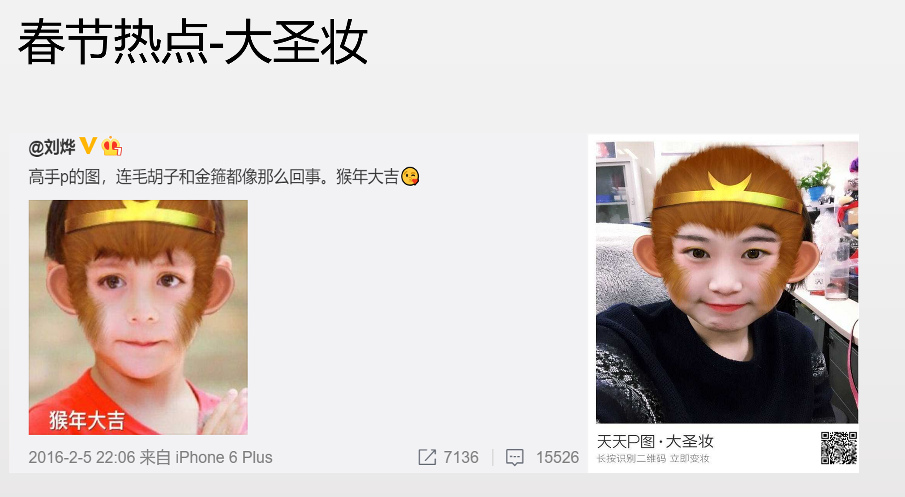
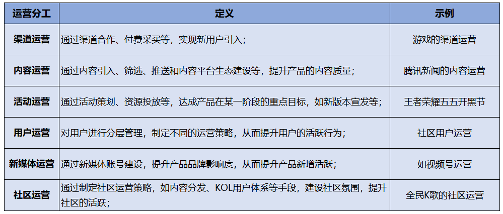
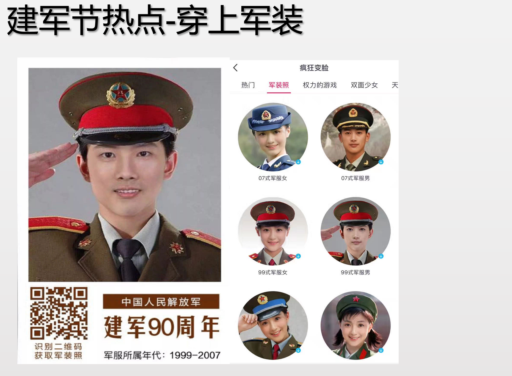
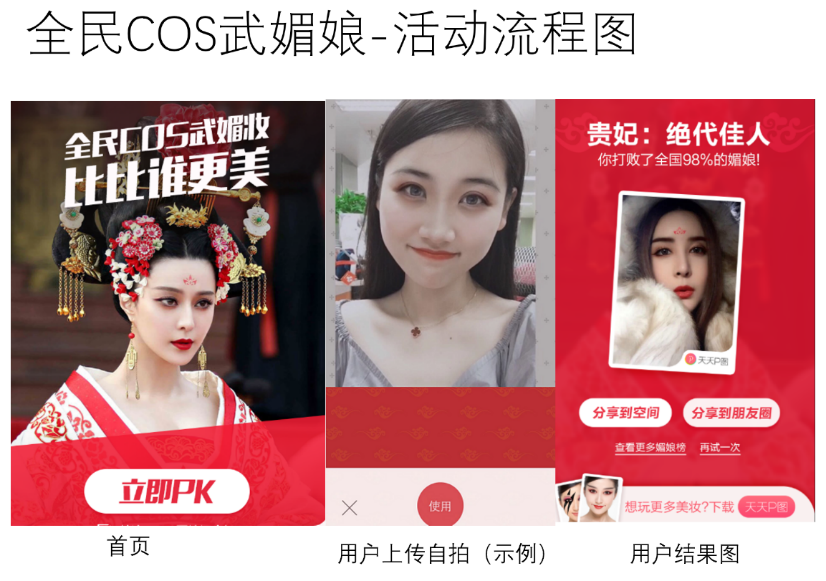
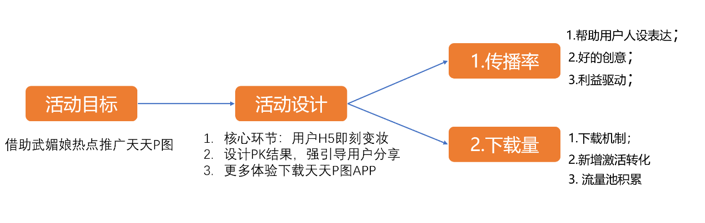
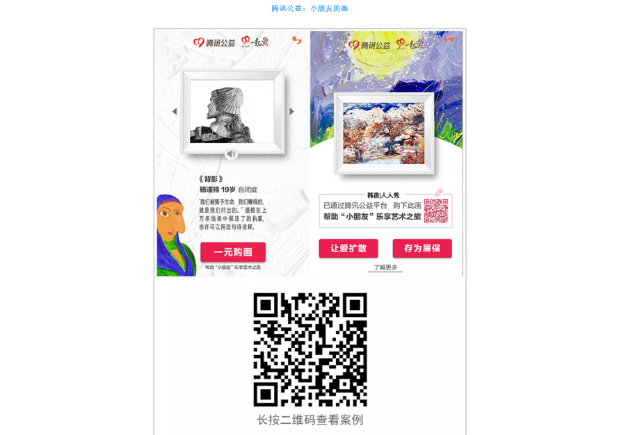

# 15 运营拉动产品增长

你好，欢迎来到腾讯大学出品的《腾讯产品18讲》。

上一讲的开头，我们提到，产品正式发布后，产品经理应该依靠各种运营手段，吸引更多目标用户，帮助用户和产品建立关系，提升产品的使用频次，不断放大产品的价值。这一讲，我们就来具体看看，如何通过运营，吸引更多用户使用产品。

**运营分工** 根据腾讯TO C产品的运营经验，一般会将运营工作进行这样的分工：

**第一种，以拉新用户为主要目标的运营工作，**包括渠道运营、活动运营等等。

以天天P图这款工具型产品为例，基础的渠道运营思路是：一方面，寻求应用市场的合作，比如换量、新品首发、Appstore的推荐机会等等，尽量获取资源位，提升下载量；另一方面，在内外部寻求产品入口的换量资源，比如QQ空间内合适的滤镜、拼图功能入口等等，增加天天P图的引流。

而活动运营，是围绕版本发布的新功能亮点或时事热点，策划一个短期活动，在各个渠道上投放，争取获得更多的产品关注度，比如天天P图策划的猴年春节变大圣妆，以一个热点妆容为抓手，在各个渠道上投放广告，拉动新增。

**第二种分工，以提升产品活跃为主要目标的运营工作，**包括内容运营、用户运营、社区运营等等。

例如全民K歌这款产品的运营工作里，扩大伴唱曲库就属于基础内容运营；吸引优质头部唱歌用户入驻并持续激励他们的活跃，就属于用户运营；对社区中优质内容进行筛选和推送，设计社区的互动机制如打赏、评论，都是为了提升社区的良好互动，属于社区运营。这里，也会有一些层出不穷、更细分的运营手段，比如社群运营。

**第三种运营分工，以提升品牌为主的新媒体运营，如视频号、微信号运营等等。**具体包括建立产品对外发声的窗口，以及用户交流的平台。在新媒体运营上，我们需要及时拥抱新的社交阵地，如果能伴随着平台快速崛起，获取更早的用户红利，运营效果可能会事半功倍。

以上这些运营工作，并不完全独立分割。例如活动运营，通常围绕一个短期产品目标来策划活动。像王者荣耀新版本的发布推广、天天P图的春节推广，这些活动运营也要引入渠道运营的同学，负责在各个渠道进行资源投放；还需要引入新媒体同学的参与，在社交阵地上发声造势。所以运营工作需要全盘协作、形成合力，让用户持续、稳定地感知同一个品牌的属性和价值。

下面给你附上了一张图，完整详细地介绍了各类运营分工和例子，你可以点开文稿看看。

**不同产品阶段运营工作的重点** 我们了解了基本的运营工作分工，再来看看不同产品阶段运营工作的重点。通常，根据用户增长速度，我们一般会将产品分为初创期、成长期、成熟期和衰退期，不同阶段，需要调整产品的运营工作重心，使得产品在整个生命周期中价值最大化。

**我们先来看看初创期。** 初创期，产品往往还不够完善，产品差异定位和核心功能还在摸索中，运营的重点是要帮产品验证价值，制造口碑，比如做好核心种子用户的运营等等。如果初创期过早大规模引入用户，可能会因为产品的核心功能不够好，而导致用户的流失率很高。这样再次拉回的成本会更高。

以QQ厘米秀为例，产品发布初期，并没有外显的流量入口，而是通过邀请码的方式，限定用户群，并跟进用户的反馈，持续优化厘米秀的产品设计。随着好友间邀请码的传播，以及近一年的产品打磨，最终带来数据的指数级增长。

**接下来，我们看看产品的成长期。** 产品经过早期验证，得到了用户和市场的认可，有了较好的留存率，用户规模有较快增长，就进入到了成长期。在成长期，运营的重点是找到好的增长模式，通过活动、渠道、裂变等手段，大规模引入用户，提升产品的新增和活跃。

以全民K歌为例，经过早期不懈的产品打磨后，在产品的成长期，很关键的一个动作是在QQ音乐的唱歌界面增加了一个“K歌”小话筒按钮，产品拉新的场景非常契合，拉过来的用户质量也很高，产品本身的核心功能留存率较好。这样一来，“新增入口”这个关键举措，就帮全民K歌快速实现了用户量级的早期飞跃。

**再接下来，我们看看产品的成熟期。** 经过一段时间的发展，市场竞争趋于饱和，导致用户增长放缓，产品就进入了成熟期。这个时期，产品经理要关注产品的转型，在变化的市场和饱和的竞争中，找到新的增长点。运营除了关注拉新，更需要重点关注留存活跃以及商业变现，争取面向已有用户，在产品的生命周期中，最大化凸显产品的价值。

**最后，我们来看看产品的衰退期。** 当获取新用户速度变慢而流失不断增多时，或许市面上已经出现了新的竞品，产品进入了衰退期。这个阶段，需要变阵出奇招，挖掘产品新的价值卖点，帮助产品延续生命周期。

**运营如何拉动产品增长** 上面，我们聊了运营工作的一些基本模式，但是具体到每一个产品，运营打法并没有百试不爽的套路。这里，我们根据一些成功案例的总结，提炼了几个运营带动增长的方法。

**第一种运营方法，抓热点。** 热点反映了用户即刻的注意力，针对热点做推广，在热点和产品间找到合适的结合点，往往事半功倍。目前有一些内容型产品会招聘热点运营的岗位，专门针对时下热点进行及时反应，调整内容推送，以此吸引目标用户。其实不仅仅是内容型产品，电商类、工具类、社区类产品，也需要关注热点。

热点往往来自于哪里呢？下面给你归归类。 **第一种，节日类热点。**对于这种热点，我们可以提前策划，找到节日和产品的结合点。以天天P图为例，曾经刷屏朋友圈的一个案例是【军装照】，这个活动由天天P图和人民日报联合在八一建军节推出，结合P图的变脸技术，为用户生成一张自己的年代军装肖像照。活动于7月30日上线，在建军节当天迅速爆发，超过一亿的用户参与，活动页面的访问次数突破10亿次，生成自己的军装照成为建军节当天最火的过节方式。除了活动本身的趣味性外，节日热点效应也极大激发了用户的分享动力，朋友圈刷屏的文案大多是向军人致敬，祝福他们节日快乐，表达自己对于军人职业的向往等等。

对于节日，用户本来就有一定的自我表达诉求；针对节日类热点，产品经理进行热点运营，就是要找到用户的核心诉求点，借助节日势能放大。天天P图后续也针对春节推出了“福娃变脸”，针对五四青年节推出了“变身前世青年”等运营活动，都取得了很好的效果。腾讯充值在今年母亲节期间，推出了“和妈妈的100个回忆”的热点活动，“想做她的盖世英雄，却常忘了多打一通电话”这类文案，也非常应景，获得了很多用户的自发传播。

**第二种，事件类热点。**对于临时发生的事件类热点，产品经理要快速“蹭热点”。还是拿天天P图举例，曾经的热播剧《武媚娘传奇》由于剧中装扮而备受热议，天天P图第一时间策划了热点活动——提供剧中同款装扮让用户COS。活动一经推出，迅速被网友传播，超过1亿用户参与活动，使天天P图登上了App Store总榜第一，给产品带来了上千万新用户。

事件类热点运营有两个需要关注的重点：一是要找到合适的切入点和契合点，巧妙把握热点事件中用户的关注点和想要表达的诉求，结合产品找到创新机会，最后还是要回归到为产品带来传播和转化这个终极目标上；二是动作要快，毕竟热点稍纵即逝，一定要尽可能抢占先机。

**第二种运营方法，找裂变。** 邀请好友可以返现、拼团、邀请码机制等玩法在产品运营中屡见不鲜，背后都是希望老用户通过分享行为，带动新用户，利用社交流量进行裂变式增长。

《疯传》这本书中，提到几个典型的传播动力：第一个是社交货币：满足用户向身边朋友炫耀身份的需要，帮助构建用户渴望的形象；第二是情绪，当我们传播的时候，有感染力的内容可以激发人们的情绪和分享的欲望，激发了其中任何一条动机，都有可能让人广泛传播；第三是实用价值，向用户展示产品本身的利益点。

以腾讯99公益日“小朋友画廊”这个项目为例，用户在99公益日网页上花1块钱，可以购买一幅自闭症儿童的画作。这1块钱同时也捐赠给公益机构。这个公益活动几乎没做任何推广，上线半天，就完成了目标基金的筹集，并刷屏了朋友圈，获得了很好的口碑。

我们可以分析一下：这里裂变的动力是什么呢？ 首先，活动极大降低了用户的参与门槛。1块钱就能买到一幅非常动人的自闭症儿童的作品，并且还能完成捐款，用户参与活动的门槛很低；其次，用户分享的动力强。用户完成捐款后，会自愿发图到朋友圈，因为这么做，既可以提升自己的社会身份，展现个人的正能量。这是“利我”的一面；也可以继续号召更多人捐款。这是“利他”的一面。

除了上面这些刺激用户动机的方式，还有一个更直接的分享裂变动力，那就是物质激励。拼多多的拼团模式、滴滴的打车券补贴等等，都是利用直接的现金激励，刺激用户分享。物质激励的分享，不仅仅对分享者有利，也强调利他行为，例如分享给好友，奖金翻倍或者各自获赠现金减免。这样利他的机制设计，会更加增强用户的分享动力。

**第三种运营方法，跨界合作找突破。** 跨界合作，是利用不同产品在品牌、渠道、内容、用户圈层等各个方面的优势，彼此联合，创造新的产品，激发新的内容创意，从而触达更大用户群，实现双赢。一些不同领域的产品，往往会碰撞出非常具有创意的火花。

比如QQ秀在2007年曾经遭遇增长瓶颈，如何能给用户带来持续不断的新鲜感，以延续高活跃呢？QQ秀尝试了和时尚杂志进行内容合作，引入《瑞丽》《ELLE》等潮流服饰搭配，帮助QQ秀装扮引进新的内容。这样的跨界合作也帮助产品打开了新局面。又比如微信红包2015年与春晚合作，红包收发总量达10.1亿次，摇一摇互动总量达110亿次。这对于一个诞生才一年的产品来说，是非常了不起的数据。这项跨界合作，激发了微信红包自身质的飞跃，而微信，也为春晚这个超级大平台，带来了新的趣味互动玩法。

还比如腾讯和敦煌研究院达成合作，在公益、动漫、文创多个领域展开创意尝试，希望推动传统文化和年轻用户的交集。QQ音乐和敦煌联合举办了“古乐重生”音乐会，让敦煌的传统文化实现了与音乐文化的跨界连接，超过1000万观众在线观看。王者荣耀取材敦煌壁画，推出杨玉环敦煌飞天皮肤，一经上线，超过4000万用户领取，也将敦煌文化破圈传播到更年轻的游戏爱好者圈层。

**总结** 以上就是今天的课程。总结一下，今天是运营篇的第二讲——运营拉动产品增长。主要知识点大概有这么几个方面： 	首先，基于To C产品运营经验，产品运营工作往往划分为这么几类：一是以拉新用户为主要目标的运营工作，包括渠道运营、活动运营等等；二是以提升产品活跃为主要目标的运营工作，包括内容运营、用户运营、社区运营等等；三是以提升品牌为主的新媒体运营，如视频号、微信号运营等； 	其次，不同产品阶段，运营工作的重点各不相同：产品初创期，运营重点是要帮产品验证价值，制造口碑；产品成长期，运营重点是找到好的增长模式，大规模引入用户；产品成熟期，运营重点是关注留存活跃以及商业变现，最大化凸显产品的价值；而到了产品衰退期，运营工作需要挖掘产品新的价值卖点，找到新的增长点； 	最后，我们还聊了运营想要拉动产品增长，你可以学习这么几个运营方法：抓热点、找裂变、找跨界合作。

 **课后分享**  今天的课后题是，结合你最近在社交平台上看到的一个刷屏热点，分析一下用户分享传播的动力是什么？欢迎在课后评论区与我们分享；关于产品你还有哪些问题，也欢迎向腾讯产品专家提问，主讲老师将回复你的问题。

**悬念预告** 欢迎继续收听《腾讯产品18讲》的第16讲《天下武功，唯快不破》。恭喜你又学完一节课，如果你觉得有收获，别忘了分享给更多的朋友，共同成长进步。
