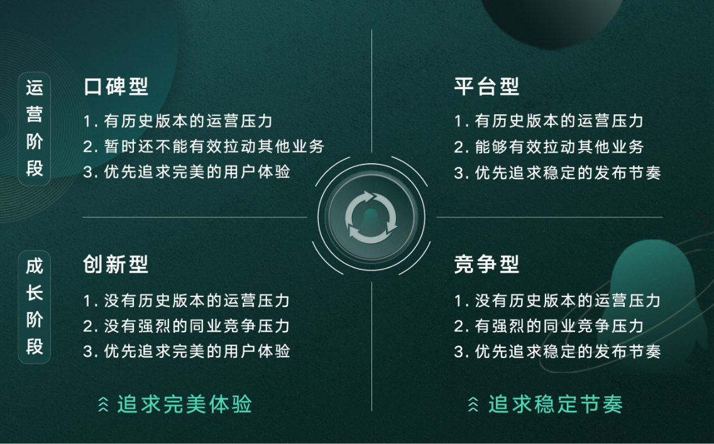
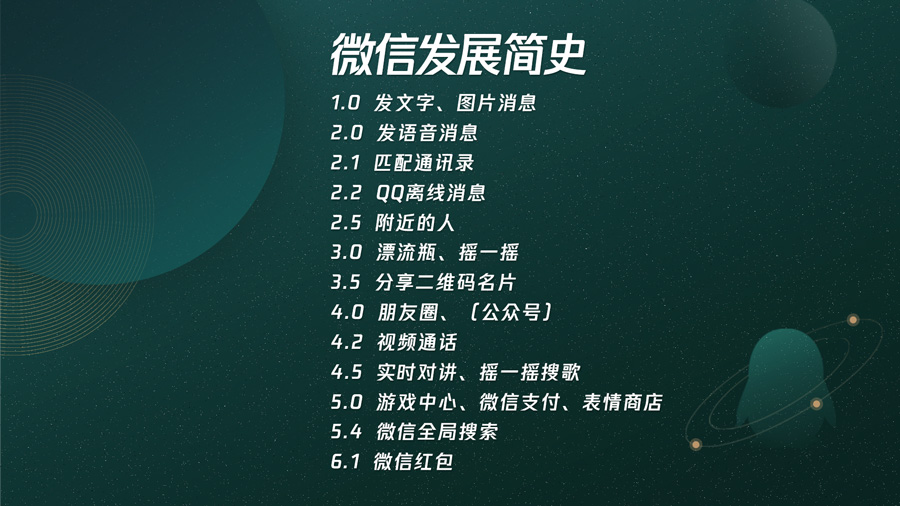

# 16 天下武功，唯快不破

你好，欢迎来到腾讯大学出品的《腾讯产品18讲》。

作为一名产品经理，每天都需要和团队中不同角色的同事们相互沟通和配合。因此，产品经理的职责，除了要理解用户的需求，并输出可被设计、开发、测试等同事理解的需求文档外，通常，还会承担部分项目管理的工作。

下面，邀请你思考以下几个问题，不要着急作答，可以仔细想一想：

第一个问题，“我们团队太小了，所以做不好大的产品”，你同意这样的说法吗？

第二个问题，“越大型的产品，越需要更长的设计时间，因此也需要更长的封闭开发时间”，你觉得这么说有道理吗？

第三个问题，“版本规划越详细越好，完成率越高越好”，你觉得这么说对吗？

这里，我们停三秒钟，你可以好好想想。

你会不会觉得，这几个问题，乍一听上去，感觉都挺有道理的，但又隐隐觉得似乎有什么不妥。我们邀请你带着这几个问题，走进今天的课程，相信你听完后，一定会对这几个问题有不一样的看法。

**为什么要快？**

这一讲的标题是《天下武功，唯快不破》，为什么要强调“快”呢？

我们说，互联网的本质就是快。过去单机软件、操作系统，基本都是按年更新；但在移动互联网时代，软件的更新频率越来越快，例如腾讯电脑管家从几年前就已经保持了每天上午、下午各一个版本的更新节奏；又比如《王者荣耀》不断推出新英雄、新玩法，让人目不暇接；就连微软最新的Windows操作系统和Office软件，也都采用了SaaS在线更新方式，确保用户第一时间可以修补漏洞、补丁，并及时体验到新特性。

从传统软件到互联网，这里发生了什么变化？

传统大型软件通常有明确的客户，较为明确的需求，版本发布和一旦发现Bug进行修复的成本极高。这个时候，质量就是生命线，无论怎么强调测试和质量保证，都不为过，发布前需要通过极其严格的质量保证流程，所以很多电信业的软件产品或项目，往往以年甚至几年为周期。

而互联网行业，面临的是截然不同的挑战：

一方面，互联网要面对海量用户，我们对互联网产品细分市场的认识，是一个从“模糊”到“逐步清晰”的过程，一开始就有一个准确、深刻的前瞻性认识，是很有难度的事儿；而相比传统大型软件，互联网产品的迭代成本很低，从概念到原型，周期短，从Alpha（内测）用户到志愿者用户、再到海量用户，可以灰度放量求证。这就给了我们通过快速迭代，来换取深度认识业务、理解用户的机会。

另一方面，在互联网上，用户的注意力消散很快，中国社会科学院2016年发布的《中国社会心态研究报告》显示，网民的注意力持续时间只有24到72个小时，如果用户遇到问题，我们没有第一时间跟进，很有可能就失去了这些用户。这也让我们不得不加快迭代的速度，持续满足用户的需求。

敏捷软件开发，是从1990年代以来，一直比较热门的开发和项目管理方法论，腾讯的敏捷（Agile）方法论，也常常被总结为“小步快跑，快速迭代”。如果说敏捷对于传统大型软件来说，主要是为了提升研发效率，降低过程性风险，那“小步快跑，快速迭代”对于腾讯或互联网来说，更大的价值在于，快速求证对用户的猜想，降低方向性的风险。

**快的体现有哪些？**

腾讯的“小步快跑，快速迭代”都体现在哪些方面，或者说可以应用到哪些地方呢？

**第一，跑得快。**我们可以通过更清晰的需求管理，更顺畅的沟通协作流程，更高效的研发管理工具，来提升整体研发的效能，不断加快版本的发布速度。

**第二，试错快。**前面说过，腾讯敏捷开发的目标在于快速验证我们对用户的猜想。这里可以从两个方面来看：

首先，我们要从心态上接纳“产品不是一竿子做成的”，在**容忍产品不完美**的基础上，不断进化。很多人可能不知道，2011年发布的微信1.0版本，只能发送文本消息，连现在看起来最基本的语音都不支持，随着语音、视频、朋友圈、公众号、微信支付、小程序在微信上不断进化，微信才逐步成为超过10亿用户的生活方式。

其次，用好灰度发布，**在小范围内不断检验猜想**，实现螺旋上升。2015年以前，腾讯应用宝APP平均2到3个月发布一次新版本，对用户需求的响应很不及时，为提升产品的整体竞争力，2015年上半年，应用宝产品团队进行了敏捷转型，其中很关键的一个点

就是让团队拥有了“发布灰度版本”的能力，新的产品需求在代码分支上开发完成后，在风险可控的情况下，通过灰度系统，将一个特殊的分支版本发布给少量的真实用户进行体验，通过特殊的版本号，观察用户数据表现，来评估产品需求的效果，只有经过验证效果不错的需求，才会被合并到代码主干，并跟随正式版本，发布给全量用户升级使用。应用宝团队通过不断进行小范围灰度验证试错，从灰度版本的数据表现及用户对需求的反馈，不断验证产品经理的猜想，提升团队对用户的理解，在2015年下半年，成为了国内市场占有率第一的安卓应用商店。

**第三种体现，转型快。**当出现新趋势，或市场的需求发生变化，产品应该及时调整方向，顺势而为，跟随行业发展的趋势。例如，面对疫情催生的远程办公需求、在线教育需求，QQ产品团队迅速响应，完善QQ群作业功能，优化QQ音视频通话能力，为老师们搭建直播课堂，扛住了QQ创立20年以来，最大的音视频流量高峰，成为最稳定的主流在线学习平台。

**第四种体现，内容快。**在产品运营方面，需要敏感反应，内容紧跟时事和市场热点，让用户感觉产品是有生命的，更容易建立产品和用户之间的情感连接。关于这一点，上一讲我们已经做了详细的介绍。

**快是有节奏的——快中有慢、快中有序**

跑得快、试错快、转型快、内容快，我们除了强调快，还想进一步强调，快是有节奏的。

腾讯原MIG（移动互联网事业群）的项目经理们，曾根据产品的不同发展阶段，把移动互联网产品分成了竞争型产品、创新型产品、口碑型产品和平台型产品四个类型。所有产品的初始状态都是竞争型产品；当它在激烈的竞争中渐渐脱颖而出，就会成为创新型产品；创新型产品会逐步成长为口碑型产品；随着口碑型产品继续成长，将有机会成为产品的终极形态——平台型产品；而在平台型产品上又可以生长出新的竞争型产品，进入下一轮循环。

这里，竞争型和创新型产品都还属于成长阶段，口碑型和平台型产品已经进入了运营阶段。其中，对于创新型和口碑型产品，最关键的任务是“极致的用户体验”；而竞争型和平台型产品最关键的任务，则是“稳定的发布节奏”，也就是“快”。

你可以点开文稿，看看我们为你准备的一张示意图。

为什么说稳定的发布节奏就等于快呢？中国飞人刘翔，在力量和爆发力都不如对手的情况下，正是凭借非凡的节奏，打破了110米栏的世界记录。2007年大阪世锦赛期间，法新社评价到：“刘翔的节奏比刘翔还伟大”。产品通过“小步快跑，快速迭代”的方法论，通过一个个迭代，逐步达成产品目标的过程，其实就相当于放慢了许多倍的一场跨栏比赛，每一个迭代，就是一个跨栏。

为什么节奏那么重要？试想在一场中长跑比赛中，一开场就全力用百米速度冲刺的选手，确实在开始阶段会取得领先，但很快会因为耗尽体力，而被反超甚至退出比赛。产品开发也是一样的，固然可以通过高强度加班冲刺，解决某个特定问题，但若想在产品的长跑中取得胜利，一定要找到适合产品团队的迭代节奏并坚持下去，张弛有度的节奏，会成为产品从一个胜利走向下一个胜利的法宝。

《敏捷软件开发宣言》的第三条写到：“经常性的交付可以工作的软件”，“交付的时间间隔越短越好”。版本发布节奏变快以后，除了可以更快地响应和满足用户的需求，还可以让团队更聚焦在满足高优先级的需求，并提升资源利用率。

我们来看看2013年的手机QQ，作为一个庞大且复杂的平台型产品，每个版本都包含数百个需求，需求变更多，平均3到4个月发布一个版本，业务满意度不高。经过对版本节奏进行优化，到了2014年，手机QQ 的版本发布周期优化到1个月，不但可以更快地打磨体验和满足用户需求，还发现原来3个月发一个版本时可以排上的需求，现在不需要做了，因为一个月后又会产生新的更重要的需求。这样一来，团队的精力都聚焦在高优先级的需求上，团队也更加有成就感，从而形成了良性循环。同时，作为平台型产品，拥有稳定可预期的发布节奏，也更方便与组织内外的合作团队达成协作。

快是有节奏的，除了快中有慢，还需要快中有序。这里所说的“序”，指的是需求价值的层级，我们需要从基础到高级，依次向上逐级满足，不能跳跃，需要有长周期深入洞察和理解的部分，不能变来变去，要有稳定的输出。

比如微信的核心能力，从微信的版本发布记录，可以大概看到熟人关系链、陌生人关系链、线下关系链、盘活关系链、商业化这样的脉络。再比如微信支付，需要先解决基础可用性，再去加载更丰富的场景，而不是在可用性很差的情况下，就猛补贴、砸市场，这样就砸坏了产品的口碑。

**快，不是均匀用力**

快，不是均匀用力，而是**在最核心的优势上持续发展，使长板足够长，借力打力**。这里，我们要能够清楚地**定义产品的核心体验**是什么，然后**围绕核心不断巩固**，在产品优化的过程中，**产品经理保持与用户的高频互动，识别真实的需求，不断迭代**。

让我们看一下腾讯会议是怎么样围绕核心取得快速发展的。腾讯会议作为一款功能型产品，一开始就把性能和效率定义为自己的核心。2019年12月底正式发布第一个版本时，核心体验就确定为“最低的接入门槛”，围绕这个核心，重点支持了两个能力：第一，无需注册，即可接入；第二，多渠道覆盖全场景，不论是电脑软件、手机App、微信小程序、电话，都可以无障碍接入会议。

之后伴随着疫情爆发新局势，从2020年除夕夜开始的40天里，腾讯会议接连发布了14个版本。对腾讯会议这一个多月的版本迭代进行复盘，会发现团队始终围绕性能和效率这两个最核心的体验在进行优化。2月3日，复工第一天，腾讯会议就开始扩容，日均扩容云主机接近1.5万台，8天总共扩容超过10万台云主机，共涉及超百万核的计算资源投入，以此来满足激增的用户需求，确保服务的稳定性。

除了性能的提升，迭代版本的功能，也围绕着怎么让开会更有效率在展开：围绕会议组织者的体验优化，腾讯会议支持了水印功能，提升了会议内容共享的安全性，以及主持人可以设置锁定会议以提升控场能力等等；围绕会议参与者的体验优化，腾讯会议提供了快速选择音频设备的功能，还有背景虚化以保护发言人隐私等功能。

随着核心体验的稳定和持续优化，再加上疫情催化多方协作、线上会议需求暴增，到2020年3月，腾讯会议每天的活跃用户数快速超过千万，并连续多日登顶App Store免费排行榜。

对于一个才发布几个月的新产品，可以取得这样快速增长的成绩，一方面，团队做到了前面所讲的研发效率快、应对市场转型快；同时，很关键的是，在快速迭代的背后，死死抓住产品的核心价值点，不断优化核心功能，夯实核心体验，而非眉毛胡子一把抓。这才把握住了增长的契机。

**总结**

今天这一讲，主要和你分享了做产品为什么要快，“快”要有节奏，以及“快”要聚焦核心而不是均匀用力。我们再回到课程开头邀请你思考的三个问题那里：

第一，“我们的团队太小了，所以做不好大的产品”；

第二，“越大型的产品，越需要更长的设计时间，因此也需要更长时间的封闭开发”；

第三，“版本规划越详细越好，完成率越高越好”。

到这里，你有没有新的启发与思考呢？

腾讯内部有一门课程叫《海量之道》，其中一条核心的针对互联网服务的技术价值观，叫做“动态运营”。根据“动态运营”价值观的指导思想，好的团队，是动态迭代成长起来的，小团队通过小步快跑，持续兴奋，可以在迭代中获得成长，并在迭代中壮大。3到5个人做不好的事情，如果换30到50个人来做，大概率会做得更烂，高举高打的失败概率非常高。

同时，好的产品，是在无数次动态迭代中进化而来的，而不是一次完美设计出来的。要避免过度设计，采用以“运营”为中心的设计、开发、验证模式，以用户数据为核心，通过用户模型，确定系统模型，小步快跑，持续迭代，持续收集用户反馈，并通过运营数据，来修正用户模型，方可实现可持续的快速发展。

 **课后分享** 

你在工作中曾经体验过最“快”的经历是什么？欢迎在课后评论区与我们分享；关于产品你还有哪些问题，也欢迎向腾讯产品专家提问，主讲老师将回复你的问题。

**悬念预告**

今天，我们讲了互联网“快”的精髓；下节课，我们会希望你在快速奔跑的过程中，学会必要的时候“慢”下来，看看身边的“灰犀牛”。请继续收听《腾讯产品18讲》的第17课《产品风险管理》。

恭喜你又学完一节课，如果你觉得有收获，别忘了分享给更多的朋友，共同成长进步。