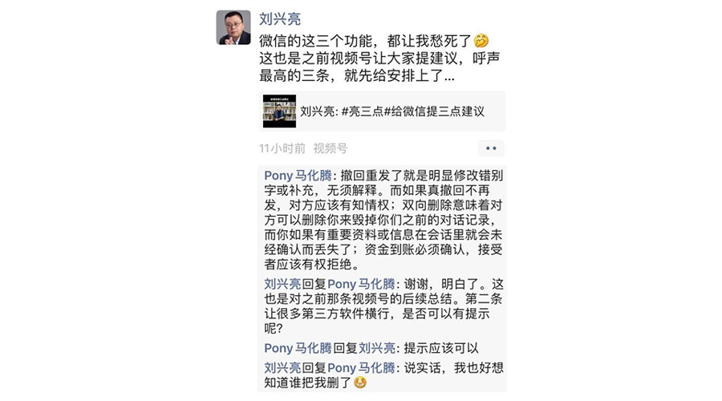

# 18 产品经理精神篇

你好，欢迎来到腾讯大学出品的《腾讯产品18讲》。

这一讲，是这套课程的收官一课。前面17讲，我们已经详细拆解了做产品“找-比-试”的三步法，课程最核心的部分已经讲完了，那么，为什么还要再加一个《精神篇》呢？

精神，听起来可能比较虚，但多年的实践告诉我们，产品在我们的手中诞生，并不是一堆冰冷的界面和逻辑，它在潜移默化中透露着属于自己的“气质”——死板的、平淡的、温情的、简单的、有理想的等等等等；而这种“气质”，正是来自于打造它的产品团队，有独特气质的产品，往往更容易与用户产生精神共鸣，也往往更容易占领用户的心智。

就像人的世界观，有万千角度，这最后一讲，我们也仅仅表达腾讯产品经理的价值观。这是我们的初心，我们也用这种精神准则，时刻审视自己的产品决策，是否符合我们倡导的价值观。

纪伯伦的那首著名诗句，我们可以衍生一下：不要因为走得太远，而忘记为什么出发。

**价值观第一条，独立思考不唯上。**

为了探索人类在21世纪新纪元，迎接未来挑战需要具备的能力，2002年，美国创建了21世纪技能学习联盟，并在多年的深入研究后，发布了权威报告，评选出本世纪最需要学习的4种能力——即Critical thinking 批判性思维，Communication skills 沟通能力，Collaboration 团队协作，Creativity and innovation 创造与创新。

其中位列首位的批判性思维，也就是我们所倡导的产品经理要保持“独立思考”的能力。独立思考体现的几个方面，我们在之前的课程中都有介绍：

独立思考，代表了产品经理「不能盲目追随用户」，在需求挖掘模块的避坑指南中，我们详细论述了产品经理既得深入理解用户，又不能对用户的需求照单全收；

独立思考，也代表了产品经理「不能盲目追随竞品」，在产品策略模块的避坑指南中，我们剖析了产品经理对待竞品的态度与思路；

我们在“独立思考”的后面，还特地加上了“不唯上”三个字，因为我们发现，对于产品新人来说，往往可以尽量冷静地面对用户，可以理智地思考竞品，但如同我们在需求落地模块的避坑指南中提到的，在职场中，产品经理有时候却不敢在上司面前讲真话。

所以，我们认为，独立思考还代表了产品经理「不能盲目追随老板」。这不仅仅是一种能力，也是一种态度和原则，它时刻提醒我们：即便我现在仅仅是一个普通的一线产品经理，也不能因为对方是一个有管理头衔的人就言听计从。

我们需要深度思考两个方面：

**第一个方面，辩证思考：老板说的是对的吗？**

作为产品经理，应该抛掉职级局限，与老板的意见有平等碰撞，从各个角度去推敲老板想法的合理性。对于那些足够自信的、有合理理由的观点，我们都需要勇敢站出来表达；对于那些还不够自信的、还没有科学理论或实践去证明的，我们可以先按老板的方向去执行，因为老板获得的信息更多，战略思考更充分，等待实践落地后，我们再去总结和反思经验与教训。

**第二个方面，延展思考：老板说的方向，还有什么地方可以完善？**

当老板提出一个合理的思路后，我们还需要“不止步于此”，再从各个角度去推敲，如何让这个方案更完善。这样才能让一个产品团队上下协同，最终呈现出来的产品战略正确、落地精准。

当然，要做到“独立思考不唯上”，还需要能有一个实事求是、正直开放的职场环境，所以，在这里，我们也倡导所有的产品管理者，能够鼓励团队高要求、勤思考、讲真话。

**价值观第二条，忍耐寂寞、追求卓越。**

这些年，随着互联网行业的蓬勃发展，产品经理逐渐成为很多年轻人向往的岗位。但大家要知道，做产品实际上是一条布满坎坷与失败的道路，远远不像外界看起来那么光鲜。所以，我们认为一个优秀的产品经理，需要具备“忍耐寂寞、追求卓越”的精神特质，才能在这条荆棘之路上坚持下去。

这里，可以分为四个层次来解读：

**第一层解读，要耐得住寂寞。**

**首先，我们需要对所做的产品有耐心。**一个产品的诞生，就像十月怀胎一样不容易，即便出生后，产品也可能对这个世界充满各种不适应，可以说，在获得市场与用户的认可之前，几乎都是产品的至暗时刻，团队很可能会产生彷徨和挫败。产品经理需要保持耐心与热情，不断打磨、优化和完善产品；如果无法忍耐这种落寞，很可能错过从0到1打造一款成功产品的机会。

像微信团队在设计朋友圈体验时，产品、设计、研发、测试加起来也不过十来人，大家在一起纠结了许多个日日夜夜，尝试了数十个版本，内部版本号从A到Z都用尽了，无数次地否定自己，又重新来过，最终才打磨出一个让广大用户喜爱的好产品。

**其次，我们需要对自我成长有耐心。**产品经理的历练之路，也像一场马拉松长跑一样，也许起点很低，但随着日积月累、坚持不懈的努力，一定可以熬过至暗时刻，获得跨越式提升。

**第二层解读，从容面对失败，善于从失败中总结。**

跟大家分享一个真实的故事。腾讯的产品经理曾聚在一起，讨论如何定义一个厉害的产品经理，其中有一个同学回答：一个厉害的产品经理，至少做出过一款成功的产品。

你是否也跟这位同学一样，有类似想法呢？

但我们更想强调的是，一款产品的成功，是天时地利人和的结果；而一款产品的失败，也会有很多方面的原因，不能完全代表一个产品经理的个人能力。成功的故事永远光鲜，但我们日常面临的，往往都是失败。

**面对失败，我们应该拥有一颗平常心，**如果你连失败都无法面对，那么你的抗挫能力，可能不足以让你在产品经理升级打怪的道路上，走得长久。

**失败后的总结和复盘，是至关重要的。**这是我们从失败中能够获取的最有价值的东西。

在腾讯产品经理通道晋级评审中，一个候选人实际业绩的输出，并不成为通过与否的决定性因素。哪怕是再小的业务，哪怕是失败了的项目，也没关系，评委希望看到的是，产品经理在其中的深度思考与总结。这才是产品经理个人能力的体现。

**忍耐寂寞、追求卓越第三个层次的解读，是对痛点高敏感、低容忍，压抑不住的改变欲望。**

在腾讯，优秀的产品经理普遍都有一股“较真儿”的劲——

他们会一遍又一遍地使用自己的产品，为找到一个新问题而雀跃；

他们不放过任何一条进入他们视野的反馈信息，会立马评判这条信息的价值，可以有哪些方式来解决问题；

他们对项目执行中的一个微小细节或问题，紧追不舍，直到找到问题的源头，并推动改善；

他们在想法落地遇到阻力时，不会轻易退缩和让步，会变通各种方式和途径，去曲线救国…

即使是小马哥、小龙这样的总办成员，也不是高高在上，他们依然保有产品经理的思维与态度，时常在公司的内部论坛、朋友圈或日常讨论中，对产品体验问题敏感而关注，还会亲自解释产品设计的思路，回答用户的疑问。点开此处的文稿，你能看到小马哥在朋友圈认真回应用户对微信的建议反馈。

**第四个层次的解读，不止步于成功，不断追求卓越。**

前面说了失败，我们再来聊聊成功。腾讯有很多成功的产品，而这些成功产品背后的团队，却并不像外界想象的那么轻松自得。如何时刻保持危机感，持续精进，超越自己，是这些团队时常思考的问题。

就像已经“火”了五年的王者荣耀，是最受用户欢迎的Moba游戏之一，在明明可以“躺赢”的环境中，团队依然以高标准要求自己，不断探索创新方向。直到现在，他们还在精进优化玩家的操作体验，通过缩短CD时间、提高打击命中率，进一步强化对小白用户的友好度。通过增加玩家互动交流中的快捷反馈，比如独立的“收到”功能，让给队友发出指令的玩家，有了非常强的反馈感受。这样看似不起眼的小功能，上线后受到玩家的众多好评。而像这样的细节优化，王者团队甚至会拿出一个大版本来做集中更新，细节功能点长达十几页。

**价值观第三条，善良比聪明更重要**

“善良比聪明更重要”这句话，非常精炼地总结出腾讯产品经理的一项重要的价值观。

张小龙在微信公开课的演讲中说：“互联网充满了‘套路’，以前是人工套路互联网，现在是机器套路互联网。对于用户来说，他们更希望被诚实地对待，而不是去‘套路’他们。”然后，小龙引出了贝佐斯的这句著名的话——“善良比聪明更重要”，AI比你更聪明，但你可以比AI更善良。

这里，我们再深入解读一下，可以分为两个层次来看：

**第一个层次，诱惑太多，选择善良，有所克制。**

产品经理每天面临无数决策，容易时常被利益驱动所干扰，选择真诚地对待用户，是我们必须保留的底线和原则。凡是虽然可以带来短期商业价值，但会极度伤害用户体验的事情，我们是绝对要Say no的。

同时，把用户的声音放在第一位，也是互联网产品经理应该保持的职业态度。在传统业态里，商店有营业时间，工作人员有工作时间，顾客需要遵循这样的规则；但在互联网环境里，只要用户出现问题，随时可以反馈，产品团队甚至要保持7*24小时的工作状态，随时关注和解决用户的问题。 

**第二个层次，科技向善：用技术与产品让世界变得更美好。**

成立21周年之际，腾讯更新了全新的使命愿景——“用户为本，科技向善”。选择善良，不再局限在产品经理的精神原则中，甚至升级成为整个腾讯公司的文化。

基于更新这个使命愿景的背景和思路，腾讯出品的《科技向善：大科技时代的最优选》这本书中，详细介绍了腾讯、国内以及世界范围内，将科技手段应用于人文和社会领域，解决一些非常具有社会价值的实际问题的案例。

比如为了保护内容生态，微信通过机器与产品设计机制，来打击“洗稿”的不良业态；

比如IEG游戏部门推出的未成年防沉迷系统，每天有1049万未成年账号，因登录时长超过1.5小时，被系统"踢"下线；在人脸识别功能升级上线后，平均每天有351万疑似未成年账户，触发人脸识别；

又比如QQ团队从2009年开始，关注视障群体，先后推出OCR图片文字提取功能、QQ空间图片语音即时描述功能，在QQ群里上线“一起看”功能，与群好友一起共同看电影，同时也能帮助视障人群，通过语言交流的形式，在看不见画面的情况下，依然能享受电影带来的乐趣。截至目前，手机QQ已经实现超过3000个无障碍特性，其中仅2019年，实现的无障碍特性就超过500个。

所以，我们看到，技术突飞猛进的今天，我们可能不用再苦恼一些产品想法由于技术的限制而不能实现，但更应该去思考如何规避技术发展所产生的负面影响，以及如何利用技术去实现更多有社会价值的创新。

**总结&课后分享**

今天这一讲，我们聊到腾讯产品经理的价值观——独立思考、追求卓越、科技向善，对于这三点，你是否也认同呢？欢迎在评论区与我们分享。

**尾声**

到这里，《腾讯产品18讲》这门课程的所有内容就结束了。感谢你对这门课程的信任，投入宝贵的时间来学习；也希望通过这18讲，能给你的工作以及生活，带来一些启发和改变。

欢迎你继续关注腾讯大学，继续关注我们持续输出的其他腾讯方法论。