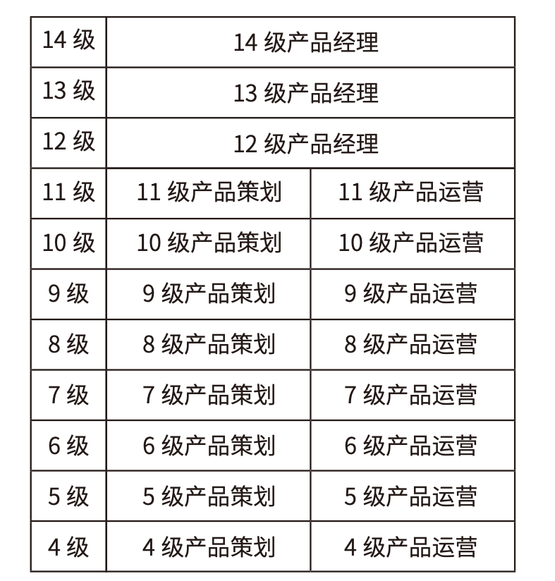
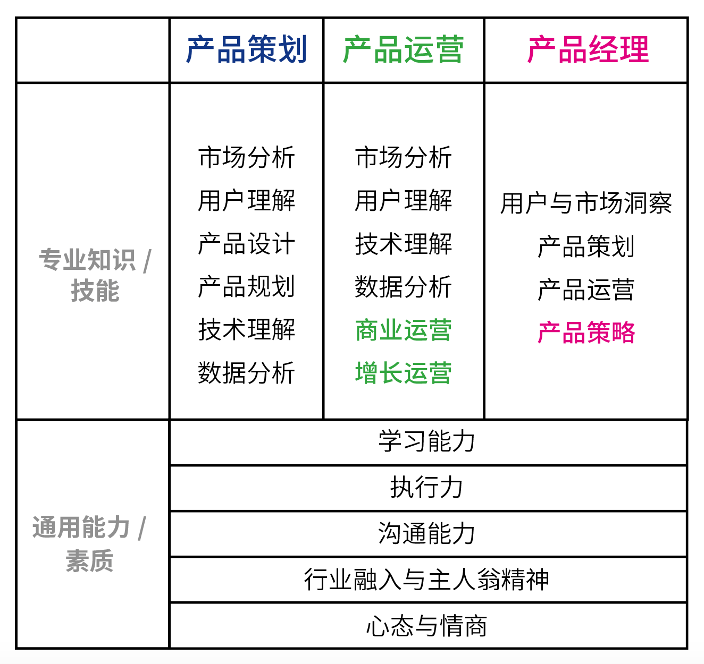

# 02 互联网产品基础：产品和产品经理

你好，欢迎来到《腾讯产品18讲》。

学习这门课之前，我们需要先达成一些共识——究竟什么是产品？什么是产品经理？

**什么是产品？** 环顾四周，什么是产品，什么不是？你能举几个例子吗？在腾讯内部的产品经理培训中，一般这么定义产品：**产品是满足人们实际需求的有形商品或无形服务**。这句话听起来有点拗口，给你拆解一下，关键点就两个：**第一，有形的商品或无形的服务；第二，真的有用。**

**我们先来说说第一个点——有形的商品或无形的服务。** 什么是商品？市面上可以获得并消费的一切吃喝玩用的东西都是商品，比如：你和朋友们聚餐吃的饭菜、你逛商场时买的东西，你在电商平台上淘的货……什么是服务？线上线下可以获取的一切便利享受，比如：外卖小哥给你送餐、房产中介帮你找房……互联网产品是非常典型的服务，它为满足用户的某些需求而产生，通过互联网来实现。拿腾讯的产品举个例子：QQ、微信给你提供通讯社交服务，王者荣耀、吃鸡给你提供互动娱乐服务……

**再来说说第二个关键点——真的有用**，行话也叫“真实需求”，产品存在的价值，是真正满足用户真实的需求。 那么现在我问你，你在马路边看到一块板砖，请问，它是不是一件产品呢？你可以停下音频，仔细想想，再接着听。答案可以“是”，也可以“不是”。如果你捡起来去盖房子，或者操起来见义勇为去打坏蛋，那它就“是”，因为它有用，前者是建材产品，后者是武器；但相反，如果你就此路过，让它永远躺那儿，那就“不是”，因为它没有使用价值，没有满足任何需求。说到这儿，你也许想说，这个道理也太简单了吧。这里我要划个重点：这个世界有太多看起来精致可人、脑洞大开的产品，却没能真正满足任何人的真实需求，纯属自嗨；互联网行业更容易造成这种局面，市场上不少互联网公司，当然也包括腾讯自己，都有过做出来没用的失败产品。所以，如何定义和辨别真实的需求，是你在这门课里需要重点关注的地方。

共识了什么是产品，那什么是好产品，也比较容易定义了：**好产品有更加明确的用户群体，能更好地满足用户的真实需求，能持续提供更有价值的服务。这里“更好地满足”，我们可以解读为产品让用户感到更有用、更好用、更好看、更好玩儿等等；而这里的“能持续提供”可以解读为产品的营收好、发展前景好等等。**

从腾讯20多年的产品经验中，我们发现，好产品除了能做到上面说的这些，还往往符合下面这两条标准：

**第一条，好产品有个性与态度。** 一幅山水作品，如果只是生搬一座山、一汪水的形象，即使画得再逼真，但没有主旨、意境、风骨，那就只能称为匠人手艺，而非艺术之作。产品也是一样。腾讯创始人之一、腾讯人尊敬的大师兄张志东（Tony）就说：“好产品背后，一定有很鲜明独特的价值主张，不会人云亦云，这就是产品的灵魂。”

微信就是一款价值观非常鲜明的产品，张小龙在多个场合谈过微信的价值观，比如“一切以用户价值为依归”、“让创造发挥价值”、“好的产品是用完即走的”、“让商业存在于无形中”等等。在这些价值观的指引下，产品团队做什么、不做什么，决策就有了一把明确的标尺。举个例子，“一切以用户价值为依归”，那么当有用户提出我是土豪，能不能单独给我开个白名单，我要发888块的红包时，产品经理做这个决策，背后要考虑的，并不是白名单这个功能开发难不难实现，而是这个功能对于广大用户来讲，会不会造成攀比、不均衡，这种攀比、不均衡，是不是用户欢迎、倡导的文化。所以产品团队的决策结果就变成了，类似这样的需求只有两种解决办法：一是没有特权白名单；二是如果这个需求普遍、强烈，那么系统会有一个规则来释放这个需求，而不是通过找关系开白名单这种方式，来满足少数人的需求。

**第二条，好产品有情怀。** 当用你产品的人越来越多，社会影响力越来越大的时候，你就不能只考虑用户量和收入了，还得考虑你的产品是否有情怀，这里也可以用“社会责任”这个词来解释，你得开始考虑你的产品、你所在的公司，需要履行哪些社会责任。这是产品越做越大的过程中，你需要修炼的功课。

今天，微信用户超过12亿，QQ用户近7亿，随着公司的发展，腾讯在2019年将愿景使命升级成“用户为本、科技向善”。有越来越多的腾讯产品，都在践行“用户为本、科技向善”。比如天天象棋和欢乐斗地主团队，都在2019年针对性地推出了“成年人”防沉迷系统，鼓励用户玩一段时间后，放下手机休息。团队把用户的健康有度，作为一项重要的产品特性，这个小小“善意”，并不能增加游戏的用户时长和收入，但能让用户感受到，腾讯的确是视“用户为本”的，用户也更愿意建立长久的信任。 

总结一下，**给产品赋予个性、价值观与情怀，才有机会让用户感到人性共鸣**；就像喜欢一个人，**始于颜值，敬于才华，最后合于性格**，用户喜欢一个产品也是这样。**当你的产品不仅有明确的用户群体，能很好地满足用户的真实需求，能持续提供有价值的服务，还拥有让用户喜欢、认可和尊重的个性、价值观与情怀，那就是一款真正意义上的好产品**。

**互联网产品是怎么研发出来的** 到这里，我们定义了什么是产品，什么是好产品，接下来，我们还需要回答一个问题：互联网产品是怎么研发出来的？

**一款互联网产品的诞生过程，可以分为5个阶段：需求分析、产品分析、产品规划、产品设计和产品落地**。

需求分析阶段，产品经理会定义清楚目标用户，通过各种方法接近和了解用户，甚至变成用户，尽可能全面、准确地找到用户需求；还会通过各种方法校正需求，逃出“伪需求”的魔咒；并且，根据技术趋势、生态革新趋势、世代变迁趋势等等，来提前预判需求。这也是我们在发刊词中介绍到的产品三步法的第一步——“找”；

产品分析阶段，产品经理对比市场上竞争对手的情况，思考当前环境和自身的优劣势，制定出合理的产品策略和周密长远的商业化策略，从而更好地切入市场，获得立足之地并谋求长远发展。这也就是我们在发刊词中介绍到的产品三步法的第二步——“比”；

到了产品规划阶段，面对这么多产品需求，做哪些？不做哪些？先做哪些？后做哪些？这些都需要进行系统的规划和安排；而在产品设计阶段，产品经理需要协同设计师一起，推进产品的视觉设计、交互设计等，并且用最低成本进行快速迭代；最后在产品落地阶段，产品经理还需要协同开发人员一起，推进产品的开发和测试、部署和发布，把控整体项目节奏，确保产品按时保质上线。

通过这5个阶段，产品实现了从0到1，但这并不是终点；产品上线以后，就进入了产品运营阶段，产品经理需要找到用户，依靠各种合理的运营手段，帮助用户和产品建立关系，不断放大产品价值，使产品受到更多人的喜爱，得到更长久的生命力。

产品规划、产品设计、产品落地和产品运营这4个阶段归在一起，也就是我们在发刊词中介绍到的产品三步法的第三步——“试”。所以你看，只要认真学完这套课程，你就能对产品的整个周期，有一个比较全面地了解；也能对产品经理在各个阶段是怎么做产品的，有一个比较系统的认识。

**产品经理需要哪些能力和素质？** 讲到这里，你可能会感叹：产品经理担负着那么大的责任，是不是对产品经理的能力素质要求会非常高呢？你又是否记得，互联网行业曾经流行一句话叫“人人都是产品经理”，似乎产品经理的入行门槛低得很。所以，究竟如何定义产品经理的能力和素质要求？市面上对产品经理能力素质要求的描述有很多，这里主要介绍一下腾讯的做法供你参考。在腾讯，从事产品相关工作的员工达到了5000多人，根据分工不同，都会归属到各细分的发展通道里。我们拿产品类最有代表性的三个岗位——产品策划、产品运营和产品经理展开举例，它们的能力等级，都从4级的入门者，一直规划延续到14级，牵引大家一路打怪升级，不断成长。从4级入门者到11级这个能力区间内，腾讯根据产品工作和能力侧重点的不同，划分为产品策划和产品运营两类职位；而从12级起往上，就是产品专家了，对于这个等级来说，能力要求非常综合，所以不再区分是产品策划还是产品运营，就统一称为产品经理了。你可以通过下面这张图，看得更清楚。

对产品策划、产品运营和产品经理这每一个职位，腾讯还会详细梳理出所需的专业知识/技能、通用能力/素质。我们还是拿这三个岗位继续举例，先说专业知识/技能：比如，对于产品策划这个岗位来讲，需要**市场分析能力**，能分析行业、竞争对手动态、用户变化，从而确定产品的战略战术；需要**用户理解能力**，能洞察用户的真实需求，驱动产品功能设计和优化；需要**产品设计能力**，能合理策划产品的业务逻辑和体验设计；需要**产品规划能力**，能规划产品的中长期发展路径；除此之外，还需要具备一定的**技术理解力和数据分析力**，能理解业务相关的主要技术原理，结合功能价值与技术代价考虑ROI，借助技术创新提升产品竞争力；能用数据科学对各类问题进行定量分析。

而对于产品运营这个岗位来讲，除了与产品策划一样，需要上面介绍的市场分析、用户理解、技术理解和数据分析能力外，还需要**商业运营能力**，能搭建规模化增长的商业模式；需要**增长运营能力**，能通过设计运营模型，经过试验测试和数据跟踪，不断提高用户新增、活跃和收入指标。

而对于产品经理这个更高阶的岗位，能力要求就高度提炼为“用户与市场洞察”、“产品策划”、“产品运营”和“产品策略”四项了，其他三项刚才都有介绍，这里的**产品策略**，是要求产品经理要能设计产品在业务中问题和优化的策略，通过实验和调研，综合评估产品策略的优劣。除了专业知识/技能，腾讯还特别强调产品经理的**通用能力/素质**，特别看中三项通用能力，分别是学习能力、执行力和沟通能力；还看中两项关键素质，分别是行业融入与主人翁精神、心态与情商。

关于这些能力的汇总，我给你画了一张图，你可以感受下。

如果说专业知识/能力、通用能力/素质的不断提升，会支撑产品经理更加胜任眼前的工作，那么价值观、精神特质层面的持续培养、熏陶，会支持产品经理走得更远。关于这个话题，我们会在这套课程的最后一节，对产品经理的精神追求，有专门的展开介绍。

**产品经理如何持续打怪升级，变得更好？** 前面我们讲了产品经理需要具备的能力与素质，你肯定很想问：这么多要求，对4级到14级的每位产品经理，都是一样的吗？答案当然是否定的，不同能力级别的产品经理，对他能力要求的侧重点也不一样。举个例子，同样是用户理解这项能力，对于4级的产品策划，只需要能在指导下收集用户需求，并且根据用户反馈，驱动产品改进；而对于11级的产品策划，就需要他能综合把握客户需求与竞品策略，寻找差异化的需求场景，形成产品的优势或提升用户的粘性。

所以你可以理解为，对于每个级别的产品经理而言，都会有一个自己能力素质要求的明细表，会清晰说明在每个能力项上，需要达到的要求。产品经理对着这张图，就可以非常有针对性地知道自己要发展哪些能力，分析短板可能有哪些，要提升哪些，这样日积月累，就能实现产品经理的自驱进化。

**总结** 这节课，我们围绕产品和产品经理这两个关键词展开，定义了什么是产品？什么是好产品？互联网产品是怎么研发出来的？我们还介绍了腾讯对产品经理能力素质要求的标准，从专业知识/能力、通用能力/素质两个方面提出了要求，对于不同级别的产品经理，能力要求各有侧重，以此来牵引产品经理主动发现自己的能力短板，有针对性地提升。

**课后分享** 今天的课后题是，你心目中最好的产品是哪款？为什么？欢迎你在留言区与大家分享。

**悬念预告** 从下节课开始，我们将正式开启产品之旅，来到做一款互联网产品的起点处，看看产品经理如何挖掘需求。
