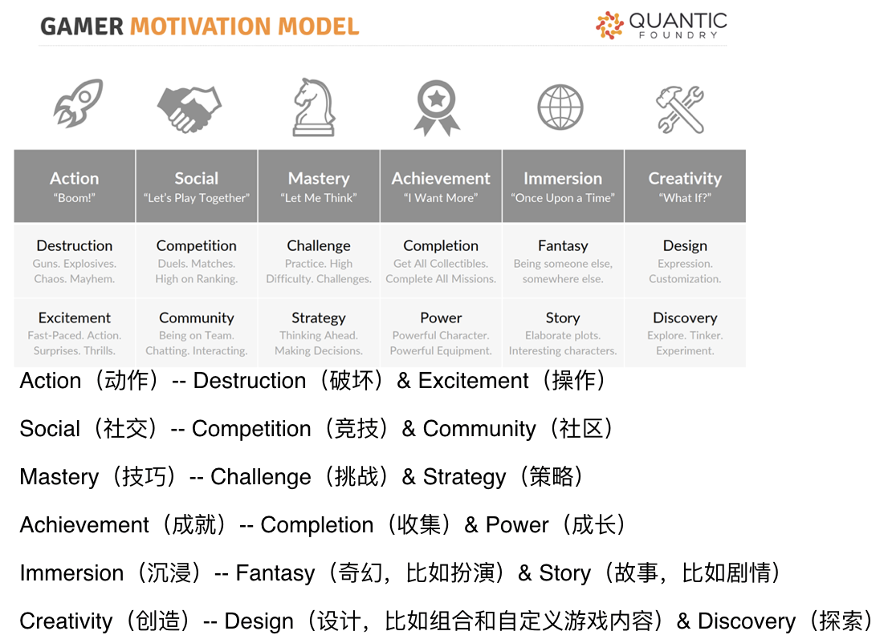
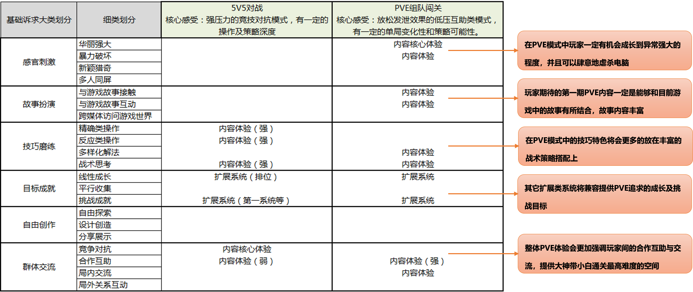

# 03 感受用户，找到需求

你好，欢迎来到《腾讯产品18讲》。

前面我们认识了什么是产品，怎样定义一个好的产品，又是什么样的一波人将它们孕育创造出来。那么从今天开始，我们将正式进入产品三步法——找、比、试中的”找“，通过【需求挖掘】模块的三节课，向大家介绍腾讯的产品经理挖掘需求的三种能力，今天这节课，我们先来看看如何培养对用户的“感受力”。

**你所不知道的“小白理论”**

互联网圈一直流传着一个“产品经理要秒变白痴”的法则。张小龙曾经也打趣说，乔布斯只需要1秒钟就能变成“白痴”，这是他最厉害的地方，马化腾大概需要5秒，而小龙自己差不多需要10秒钟

大神们所追求的这个“小白理论”看起来比较好理解：变“白痴”，其实就是说我们在看待产品的时候，不能以我们创造者的专业身份来看，而需要用同理心，将自己转变为一个产品的典型用户，才能准确挖掘到用户心底最真实的诉求。

不过今天我想告诉你，这只是“小白理论”最最粗浅层次的一个理解，当我们真正要在实际工作中去践行这个理论的时候，需要关注两个更深刻的点：

**第一，同一个产品，多类不同的典型用户**

**随着产品的演进发展与壮大，一个产品可能由单一目标用户实现破圈层的进阶。受众范围越广，用户需求越复杂，用同一个产品来承载的难度也越高，产品经理对用户需求的挖掘、把握、平衡也就越困难**。

腾讯正是一个擅长做海量用户产品的训练营。像QQ，至今已经是一款存在20年的产品了，每个月在QQ上活跃的用户将近占据了中国人口的一半。试想一下，你要在这里上线一个新功能，让6、7亿用户都能满意，是不是顿时觉得压力不小了。

而QQ厘米秀团队就用一种巧妙的方法，让最初这个相对小众的创新功能潜移默化地流行起来。厘米秀的诞生来源于QQ产品经理对整个用户大盘里一波非常年轻、极具个性表达诉求的用户的深度洞察，他们追求品牌、热爱新奇、忠诚原创、沉浸二次元。厘米秀的个性装扮、动态轻互动的功能，得到了他们广泛的喜爱。

**厘米秀团队的巧妙方法**是什么呢？他们采用了非常克制的隔离策略来设计这项新功能：

首先，**在产品推出近一年的时间内，都是通过邀请码限定用户群**；直到现在，厘米秀都没有设置开放的入口，需要通过搜索厘米秀进入开通页，激活后才可以使用这项功能。团队希望借力好友之间的传播，让喜欢这个功能的用户自己去发现到底要如何开启它。

其次，**对于非目标用户，做到完全的无感知**。即使在一个群里，有厘米秀的用户存在，他们发送的互动动作，产品团队也将其设计为转化成GIF图表情的形式发出，让非厘米秀的用户感知不到这里有什么特别功能的存在。

普通产品大多希望用户更多的停留，更少的离开，然而厘米秀的产品经理却将这个功能的关闭入口做得极其突出，就是为了让误入其中的非目标用户，能快速退场，不被骚扰。

所以，在面对一个海量用户产品的时候，产品经理必须是一部分人的“白痴”，同时又是另一部分人“最精明的保护者”。

**“小白理论”第二点深度解读：同一个用户，不同的角色和场景**

也许你现在做的并不是像腾讯一样面向海量用户的产品，那是不是就当一种“小白”就可以了呢？当然没那么简单。我们还需要考虑用户所在的场景、身份或时机，面对同一个产品的思考，我们甚至需要在用户的多种不同角色中进行切换。

比如当我们讨论一款像腾讯新闻、腾讯视频这样的内容消费型产品时，往往会把用户区分为强目的型、弱目的型和无目的型三种。在进行首页设计的时候，就会分析这三类用户不同的诉求，在同一个产品首页，用不同的浏览路径去满足不同类型的用户特定诉求——强目的型用户，会直达搜索；弱目的型用户，会倾向浏览感兴趣的频道；而无目的用户，更倾向消费个性化推荐的内容。

而且用户的场景也不是一层不变的，一个爱看电影的用户，有一个偏向的品类，初始属于一个弱目的消费者；当今天发生了一个娱乐大事件，他想去了解详情的时候，他就变成了一个强目的消费者；当他有10分钟空闲时间，想随便刷刷看的时候，他又变成了一个无目的消费者。

所以产品经理不仅需要有变“小白”的能力，还需要有能在“小白”的不同角色之间自由切换，进行深度思考的能力。

**那些内向大牛的故事**

以上，我们通过“小白理论”的进阶，让你知道“用户”绝对不是简简单单的一个群体。对自身产品用户群的精细化分层，对用户不同场景的深度洞察，是我们去理解用户需求的重要基石。

分清楚了用户，接下来我们就需要设身处地去贴近用户，感受用户，发现他们的痛点，挖掘他们隐藏在内心的人性秘密。

那么，我们应该怎样培养对用户的这种“感受力”呢？

首先，你需要先了解自己。我们发现一个有趣的现象，QQ和微信这两大国民级产品，每天满足十几亿人的交流沟通，而这两款明星产品却出自于两位不善言谈、内向慢热的产品大牛之手。

小马哥从小热爱天文，15岁就成功观测了哈雷彗星的回归，并用学校的器材拍了一些照片，成为深圳中学第一个找到哈雷彗星的学生。即便创办了腾讯，取得今日成就，把目光投向那浩瀚孤寂的星空，依然是小马哥心之所爱。

而微信之父张小龙从前也是一个喜欢独来独往的人，他曾凭一己之力，写下几万行代码，创造出红极一时的邮箱产品Foxmail。而几年前，他又以高尔夫职业-业余配对赛冠军的成绩登上热搜，而这项小龙痴迷多年的运动，被称为“一场与自己较量的比赛”。

内向，当然不是产品经理的什么特质。只是内向的人表面平静，内心却往往拥有更细腻的情感，喜欢独处，通过面向自己的深度思考来获取能量，改变世界。

如果你也是这样的人，请珍惜上天给你这些独特的能力。它可以帮助你在产品经理的这条道路上，拥有那么一点点比他人更有优势的天赋。

**没有天赋，对用户的“感受力”可以培养吗？**

如果我们不是天生的共情者，就无法做一个好的产品经理了吗？当然不是。即便是那些有天赋的大牛，他们都是依赖长期的积累与练习，才能让自己的共情能力发挥作用，敏锐地感受到用户的需求点。

那么如何培养对用户的“感受力”呢？我们提供四大方法模型供你参考。

**第一种方法，静听法。**

你或许知道，要了解用户，那一定需要倾听用户的声音；但听是一方面，我们还特别强调一个“静”字。

这里又包含了两种场景：

第一种，需要我们不带任何干扰地观察和倾听。在不影响用户隐私的情况下，我们可以“悄悄地”从旁观察用户是怎样使用我们产品的；或者在社交平台上搜索关键词，去看看用户如何评价或描述相关场景的；

第二种，当我们进行用户调研时，要尽量避免对用户的主观引导。这里推荐一本关于用户调研的书，来自戴力农的《设计调研》，虽然这是一本针对设计师的调研方法工具书，但非常细致和系统地介绍了各类调研模型，对产品经理也有比较大的启发性和实用性。

**第二种方法，忘我法。**

这是一种情景代入的心理学方式。可以有三个步骤来实践：

第一步，忘记自己产品经理的身份；

第二步，为自己虚构一个目标用户的人物角色，想象自己是谁、出生在哪、今年多大、在此之前经历了什么样的人生故事；

第三步，找一个无人的安静环境，开始冥想，想象那个虚构的你，是在什么样的场景下，有什么样的心理，具体会如何来使用这款产品。

如果你读过《刻意练习》这本书，你大概能明白，其实这就是一个“变小白”的刻意练习。虽然你会在初期耗用比较长的时间，但只要坚持练习，大神们的“几秒变小白”对你来说，也可以同样应用自如。

**第三种方法，模型法。**

我们可以利用专业的心理学模型来帮助分析用户深层动机。

比如玩家行为动机模型（Gamer Motivation Model）是由一家名叫Quantic Foundry的专注于游戏动机的市场研究公司总结输出的方法论。它总结了玩家在游戏过程中所涉及的动作、社交、技巧、成就、沉浸、创造六大诉求，以及每大核心诉求下的分支领域。

​												（来自Quantic Foundry官网）

王者荣耀团队在探索一些新玩法时，也采取类似的模型对玩家的诉求进行分解，基于现在的玩法对诉求进行分析和评分，以此推导还有哪些未满足玩家的诉求，结合用户调研，对准备进行尝试的新玩法进行摸底研究。

例如，王者荣耀团队在调研中发现，PVE玩法在约一半的活跃玩家中受到期待，特别是低段位、非竞技型玩家期待度更高。而根据玩家诉求模型进行分析，也可以发现，相比排位赛10-20分钟一局的游戏时长，PVE玩法提供了更加短平快的时长模式，PVE的技巧特色不再局限在排位赛的操作走位上，更多放在丰富的战术策略搭配上，而且整体PVE体验更强调玩家之间的合作互助和交流，提供大神带小白通关最高难度的空间，相比从前的核心对战模式，为玩家提供了非常差异化的诉求点。

**第四种方法，习惯法。**

让同理心成为我们的一种习惯，比如把观察用户、对用户行为和背后动机的敏感度，作为日常生活中时刻去关注的点。

曾经与张小龙共事过的同事，分享过一个有趣的小故事：大家一起开会，小龙会指着一位同事放在桌上的手机问道：“你为什么要把手机朝下，扣在桌面上？”

我们是不是都有类似经历，可能是怕手机屏幕的亮起干扰注意力，也或者是出于对自己隐私的保护，会不自觉把手机朝下放在桌上。但我们似乎对这个动作习以为常，从未去仔细琢磨我们为什么会这样做。

一个好的产品经理，能够观察用户不起眼的微小动作，喜欢揣测他人的动机，并验证自己是否猜对了，养成这样的习惯，可以提高自己对用户心理诉求的敏锐度。

即便不是讨论用户需求，我们在团队合作中，与上级的沟通中，在面试时，是否都能站在对方的立场，去想想对方需求什么，同理心的应用，会为我们的职场和生活，同样带来很多好处。

**总结**

这节课，我们进入产品三步法——找、比、试中的”找“。在找需求的环节中，最重要的是把自己变成产品“小白”的能力，不仅需要变成“小白”，还能在不同的“小白”，以及“小白”的不同场景和角色中进行自由切换和深度思考。

如果你是天生的共情者，请好好珍惜你的天赋；如果没有天赋，我们也能够依靠静听法、忘我法、模型法、习惯法这四个方法来逐步培养自己对用户的感受力。

**课后分享**

用专业的心理学模型来帮助分析用户深层动机，我们只介绍了玩家行为动机模型，其实还有很多心理学社会学的书籍值得产品经理去阅读，比如《消费者行为学》、《乌合之众》、《定位》、《影响力》、《失控》等，都是大名鼎鼎的必修书单。

那么你还有哪些收藏书籍，在用户需求洞察方面对你有所启发呢？欢迎在留言区与大家分享。

**悬念预告**

今天我们谈了发现用户需求，那是不是对用户想要的，就要盲目追随、照单全收呢？在下节课以及【需求发现】模块尾声的避坑指南中，我们还会教你如何跳出用户身份，站在产品角度消化需求，做出平衡与取舍。

欢迎继续收听《腾讯产品18讲》第4课《不断试错，校正需求》。恭喜你又学完一节课，如果你觉得有收获，别忘了分享给更多的朋友，共同成长进步。