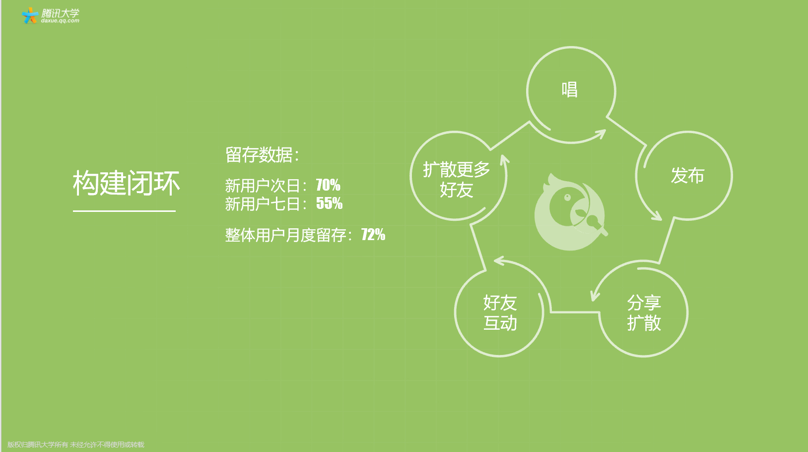

# 07 发掘优势，确定产品定位

你好，欢迎来到腾讯大学出品的《腾讯产品18讲》。

上一节课，我们讨论了在激烈的市场竞争格局中，怎样寻找差异化，在红海中站稳脚跟，又怎样在蓝海中找到新的市场和机会；这节课，我们要聊一聊，在具体的市场环境下，如何审视自己，找到产品的定位，从而成功切入市场。

**引子** 还记得上节课开头那个早点摊的例子吗？在社区出现了好几间早点摊后，这位早餐店老板无论是靠增加分量，还是搞促销活动降价，都无法扭亏为盈，最后不得不退出这个红海市场。如果他能早点找到自己的核心优势，能想清楚自己要怎么切入这个市场，怎么在这个市场里差异化定位，结果会不会不一样呢？

**什么是产品定位** 什么是产品定位？产品定位要思考和回答四个问题： 	第一个问题，**产品的用户是谁？在哪里？** 	第二个问题，**产品能满足用户在哪些场景下的什么需求？**或者说产品能解决用户在什么场景下的什么问题？ 第三个问题，**产品的核心能力是什么？**和其他产品相比，差异点是什么？ 	最后，**产品的边界在哪里？**

前三个问题都很好懂，第四点，产品的边界是什么意思？ 产品有明确的边界，就能让我们知道，什么是我们不做的，明白这点，可以让我们在产品的初期，把本来就有限的资源，更加聚焦地使用。我们说，一个产品应对一个核心诉求，解决一个核心问题；边界就像是一个弓箭的箭头，最开始的边界越小，箭头就越锋利；随着切入得越深入，边界就会越来越大。 每个产品都要有自己的定位，这个定位越简单越清晰越好，最好用一句话就可以讲清楚。比如腾讯电脑管家的定位是“保护你电脑安全的默默无闻的工具”；手机QQ浏览器的定位是“提供快速简洁浏览体验的效率工具”；QQ邮箱的定位是“为亿万用户提供高效稳定便捷电子邮件服务的工具”。

**马氏三问** 说到定位这个话题，我们稍作一点延展，聊聊腾讯内部流传着的“马氏三问”。早期的产品立项，申请人需要到总办会议上去说明项目的重要性与必要性，“马氏三问”就来自以小马哥为首的腾讯总办的立项评审的思路。这三个问题都能得到很好回答的产品，往往都能得到较好的发展。 	**第一问：这个新的领域是不是你擅长的？**第一个问题首先关注的不是这件事本身，而是“在这件事情上，你相比其他人的优势是什么”。对于用户需求，可能有很多产品经理都挖掘到了，但凭什么是你来满足呢？ 	**第二问：如果你不做，用户会损失什么吗？**资源永远有限，而事有轻重缓急。如果不做，用户也不会有什么损失，那么这多半是一件锦上添花或者优先级没那么高的事；而如果一开始就想清楚了，这是一件“不得不”或“非做不可”的事，那么团队在后续做的过程中，即使遇到很多困难，也能坚持，不容易抱怨。比如，腾讯刚开始进入“安全”这个领域时并不擅长，但我们认为“安全”是用户的核心价值，不容有失，经过多年卧薪尝胆，做出了电脑管家、手机管家这些口碑产品，也建成了今天以七大安全实验室为核心的业内顶尖的安全团队。 	**第三问：如果做了，在这个新的项目中，你能保持多大的竞争优势？**做产品不是一锤子买卖，在前期规划时就要考虑到运营阶段的需求，尽可能想得更长远一些，也有助于在运营过程中持续积累自己的优势，构建产品的“护城河”。

**如何定位** 我们讲清楚了什么是产品的定位，你肯定很想问，那究竟应该如何给产品定位呢？其实，找到产品定位的关键，是对比竞争对手，找准差异点和自己的优势，我们也叫核心能力，并在这个基础上，不断打磨自己的核心能力。

那怎么找到自己的优势呢？我们认为，互联网产品通常可以从“产品”、“渠道”、“生态”三个方面来思考和挖掘自己的核心能力。 	**首先我们来看产品。**在这个方面，你可以考虑，我是不是可以提供人无我有，或者人有我优的独特的内容或服务。比如，腾讯视频的核心能力就在于，以丰富、独家、高质量的自制内容来吸引用户。 	**第二，我们来看渠道。**在这个方面，你可以考虑，与其他竞争对手相比，我是不是可以更高效、或者更低成本地触达到目标用户。比如，越是头部互联网公司，越是拥有巨大的流量，广告业务就越是能赚钱。 	**最后，我们来看生态。**在这个方面，你可以考虑，我是不是有很多上下游合作伙伴，愿意和我一起，更好地服务我们的用户，形成一股更大更强的力量，远远好过你一个产品单打独斗。举个例子，今天，用户已经离不开微信支付、公众号、小程序这些产品，而这股产品力量的强大，都有赖于服务商、创作者等合作伙伴的投入。

**全民K歌初期是如何确定产品定位的** 到这里，我们聊了什么是产品定位，如何给产品定位，接下来，我们就拿全民K歌这款产品举个例子，让你更好地理解初期应该怎么找到你的产品的定位。

全民K歌是一款以K歌为主要功能的APP，2014年底面世，2017年底就拿到了腾讯内部产品的最高荣誉——名品堂大奖。产品当初立项时，K歌市场其实竞争已经非常激烈了，诞生了不少明星产品。产品团队做的第一件事，就是研究用户在音乐这个领域里的需求，比如“听”、“看”、“唱”等等。在“听”的领域，腾讯做出了一个还比较成功的产品——QQ音乐；但在“唱”的领域，我们还没有成功的案例，所以团队觉得“唱”可能是有潜力和机会的。既然决定了要试一下做“唱”这件事，究竟如何实现呢？是把它作为一个简单的功能，放到QQ音乐里，还是做一款独立的产品呢？

这里面的优劣势很明显：如果变为QQ音乐的一个功能，好处是这个产品可能一发布就有百万甚至千万的用户使用；但缺点是什么呢，唱歌就永远只是这个产品的一个子集，用户是不可能扩到非QQ音乐的用户群体里的。而如果要做一个独立的唱的APP，缺点也很明显，获取新用户的难度非常大，一个新APP的成功可能性会非常低，你会变成一个很挣扎的小项目。

很两难的决策。过程中，产品团队做了很多用户调研，发现其实“唱”和“听”这两个用户群，还是有很大差异的，比如有一些老人家和小孩，也许他们不经常听歌，但很愿意唱歌。如果它作为一个独立的产品，也许会获得更强的成长性。所以，团队最终决定把全民K歌做成一个独立的产品。 第三，需要思考这个问题：推出这款产品后，究竟有哪些竞争优势，可以吸引到用户？团队发现腾讯最强的就是社交关系链，如果把社交关系链和唱歌这个能力结合在一起，也许会擦出非常漂亮的火花。经过这三步思考，终于明确了全民K歌这款产品的定位：**做一个具有熟人关系链的独立的唱歌工具。** 

**找到定位后，要把核心优势做透** 是不是找到产品定位后，就高枕无忧了呢？我们继续来看明确了定位后，全民K歌团队接下来又做了什么。

首先，围绕唱歌工具这个核心定位，不断提高产品的基础体验。团队开始各种各样地体验，除了体验竞品，还有一种方法就是把自己当做小白用户，产品经理一下班，就跑到各个KTV里去唱歌，去观察大家怎么唱歌，有什么问题，有什么习惯。比如，他们会发现一些歌的前奏怎么这么长，能不能有一个跳过前奏的功能，让用户直接唱就好了。又比如，用户开始唱第一句的时候很容易找不着调，能不能有一个首句辅唱的功能，让用户听到第一句的原声。还有，有些用户很喜欢唱歌，但唱得不好，可能有些歌就只会唱高潮部分，能不能做一个截曲的功能，用户可以选择唱完一首歌，也可以选择截取某一个片断去唱。通过这些小小的功能点的创新，全民K歌一发布就马上得到了很多好评，用户说体验真的太贴心了。

除了把唱歌的功能做透，全民K歌的第二个发力点，就是在产品中引入熟人关系链，连续推出了好友合唱、好友打擂、好友排行等社交功能，不仅引爆了新的用户增长，也为产品构建了闭环的能力。这个怎么说呢，就是用户带着“唱”的需求来到全民K歌，唱完后发布自己的作品，为了让更多好友听，他会主动把自己的作品分享到第三方应用比如微信、朋友圈、QQ、QQ空间等等，他的好友听完后，会评论或者送花，无论哪一个行为都会形成一个新用户的下载，有可能互动完了，觉得自己也想PK一下，于是成为一个新的种子用户，他也进去唱，从而进入下一个循环。

通过唱歌功能和社交关系链这两项能力的打磨，全民K歌半年就实现了日活跃用户破100万，用户留存72%，迅速成为行业领头羊。

从这个案例，我们可以总结什么？产品初期，定位一定要清晰和聚焦，把核心需求做透，持续打磨，才能快速抢占市场。我们常常会听到一些创业团队说要做一个人人都需要的平台，在这里购物、吃饭、聊天……做任何事情，听到这样的定位，往往会让人有一些担心，因为这个平台包含了太多需求，很难在初期聚焦资源投入。

**定位需要随着产品的不同周期而调整** 定位是一成不变的吗？不，定位需要随着产品的不同周期而发生变化，随着市场切入越深，产品边界扩大，当用户群种类和属性发生变化时，定位也会转型。所以产品经理要结合产品的生命周期，动态调整定位，改变不同打法。

我们继续来看全民K歌的例子。产品上线一年后，当用户量级从百万到千万时，团队发现用户需求也在发生变化：每天愿意唱歌的用户，永远是一个恒定的比例，无论做什么样的引导，大概每天只有40%的用户愿意唱歌，但与此同时，每天大概有60~70%的用户愿意去看好友的内容，或者去处理一些跟他有关的消息。

这时候，产品经理们就开始反思最初的产品定位，这样的一款工具化产品是否已经不适用于现在的发展，我们是否需要做一些尝试和调整，把它从原先的工具变成一个社区呢？

因此，在新的版本里，产品经理做了一个很大胆的尝试，把用户的好友动态放到了最主要的界面，把用户消息变成了一个独立的模块。非常令人欣慰的是，唱歌的用户并没有因为这个调整而减少，同时原先60~70%的看动态的用户，现在提升到了90%。整个社区也变得更加活跃，用户黏性得到了很大的增强。 

所以你可以看到，全民K歌在这个阶段，完成了一次比较成功的定位的转型——从一个简单的工具，升级为了一个更具有想象空间的社区产品。

**总结** 总结一下，今天这节课，我们分享的是产品如何在市场中找到定位。主要有这么几个观点： 	首先，产品定位要能回答清楚四个问题：产品的用户是谁？产品能满足用户在哪些场景下的什么需求？产品的核心能力是什么？产品的边界在哪里？ 	接下来，如何给产品定位呢？关键是对比竞争对手，找到自己的优势，并不断打磨，我们认为，互联网产品的优势一般存在于产品、渠道和生态三个领域，你不妨对照找找看。 	我们以全民K歌的例子，说明在产品的初期，定位一定要清晰聚焦，围绕定位持续打磨，才能打开市场；而产品定位不是一成不变的，随着产品成长，边界也在扩大，定位也要转型。

**课后分享** 今天的课后题是，你能一句话说清楚你的产品的定位吗？你又是如何确定这个定位的呢？欢迎你在留言区与大家分享。

**悬念预告** 今天我们讲了产品应该有自己的边界，也就是需要有自己的定位，但找准定位只是切入市场的第一步；之后怎么把产品的用户和流量，转化成商业化的价值，谋得产品的长期生存与发展呢？

请继续收听《腾讯产品18讲》第8课《确定产品的商业化模式》。

恭喜你又学完一节课，如果你觉得有收获，别忘了分享给更多的朋友，共同成长进步。

