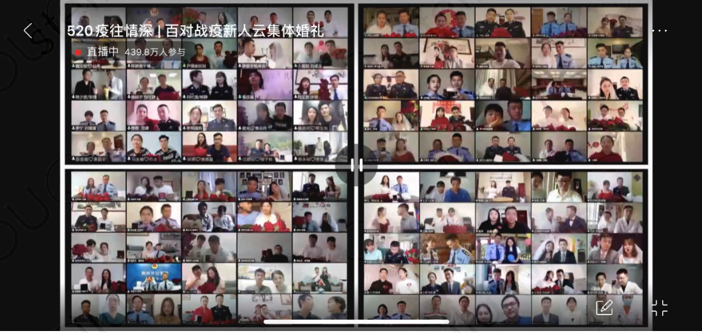
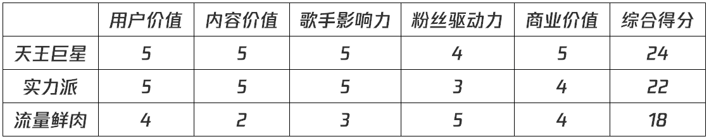
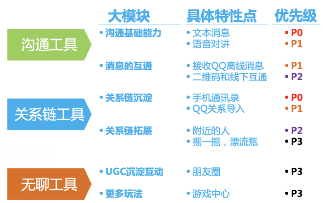
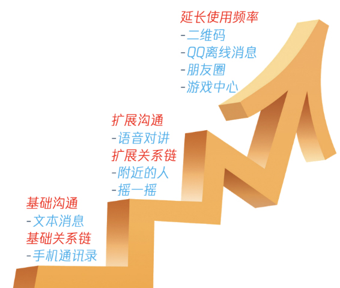

# 09 紧盯产品需求的管理目标

你好，欢迎来到腾讯大学出品的《腾讯产品18讲》。

前面8讲，我们已经讲完了“找-比-试”三步法中的“找”和“比”，想必你已经学会了如何发现靠谱的需求，找到机会；也学会了面对纷繁复杂的内外部竞争环境，认清自己，审时度势，确定产品的定位，制定周密长远的商业策略。

到这里，你就像一座大厦的总设计师，拿出了设计图；接下来，再完美的设计，也需要后期良好的项目实施，通过一期一期的工程，把设计变为现实。

从这节课起，我们将进入“找-比-试”三步法中的“试”——做好产品需求规划与管理，落地执行是关键。

这一讲，我们就先聊聊需求规划的话题。

**什么是需求规划？**

什么是需求规划？如果我们把一款互联网产品比作一间大厦，那么产品需求就是这个大厦的每一砖每一瓦。试想一下，现在我们要开工搭建大厦了，从哪里着手？先搭什么？后搭什么？进度怎么控制？解决这一系列问题的过程，对于产品经理而言，就是需求规划的过程。

如何做好需求规划？

那怎样做好需求规划呢？我们认为核心在于**回归到用户价值，围绕所定义的问题，展开三步法，步步为营，逐层构建。**接下来，我们围绕这个三步法，一一展开介绍。

**需求规划第一步：锚定目标**

锚定目标是做需求规划的核心准则。在具体的产品场景里，需求千千万，有大有小，有轻有重，每来一波，你都需要做一次过滤和判断：做还是不做？做了会怎样？不做会怎样？先做什么，后做什么？而目标，就是你手上的筛子，滤掉不该做或不该现在做的；再对留下的需求，按价值权重进行分类和排序。

既然目标这么重要，你肯定很想问，那目标究竟怎么定义呢？

这里还是要回归到你的产品本身，**想清楚目标用户是谁、在什么场景下、要解决用户的什么问题，产品目标最终就是要把问题解决到极致。**

归纳一下互联网产品的目标，一般可以分为四类：

**第一类，极致满足用户需求**

在互联网产品的初生期，我们认为最重要的目标就是**充分解决核心用户群的问题，持续挖掘极致的用户体验。**

以全民K歌这款产品为例，2014年酝酿诞生期，产品团队就希望通过像素级拆解竞品，了解其优劣势；并充分依托腾讯的曲库和关系链优势，把用户“唱歌”这个核心需求做透，打磨出满足用户极致体验的功能，制定了两年做到200万DAU、市场排名第2的小目标。

聚焦这个目标，团队集中有限资源，做好最重要的事。产品经理疯狂体验国内外各种竞品，去各个KTV体验K歌的过程，挖掘用户K歌时的痛点，优化K歌的核心功能：比如，前奏太长，就做出了“跳过前奏”的功能；第一句老找不到调，就做出了“首句辅唱”功能；给唱歌水平一般的用户，提供“演唱片段”以及“音调转换”等很多贴心、极致的体验。这些核心功能需求优先上线后，取得了非常好的口碑，全民K歌得以快速破局。

**互联网产品的第二类目标是——留住用户，落地生根**

当产品能快速积累用户，接下来，怎样真正留住用户，也是非常重要的工作。这就要求产品团队能持续挖掘和快速满足用户的需求，让用户离不开产品，让产品真正站稳脚跟。

前面的课程里，我们知道了腾讯会议于2019年12月才正式进入在线办公领域，团队当时希望稳扎稳打，打磨产品，在2020年DAU能突破5万。

然而，新冠疫情突然爆发，彻底打乱了计划。为了助力抗疫，除夕夜，团队迅速做了决定，把对外收费的100方通话功能免费开放。当发现政府机关、医院等的远程抗疫会议，100人是远远不够的，团队又将免费通话容量扩大到300方。2月3号复工复产第一天，巨量线上办公需求涌入，各路竞品先后崩了，腾讯会议最开始以5万DAU设计的系统终于承受不住，也崩了！

“我们崩了，用户怎么办？”那一刻，产品团队非常担心。这是一个绝对不能输的战斗，一旦输掉了，想要再追回用户就很难了。这个时刻，腾讯TEG（技术工程事业群）的兄弟姐妹们火速支援，8天内扩容了10万台云主机，涉及超百万核的计算资源投入，创造了中国云计算的历史记录。一番努力之后，腾讯会议几乎再也没有崩过。

产品一路突飞猛进的同时，还快速推出不少贴心的小功能，比如在5·20当天，为100位医护、警察等抗疫新人举办集体在线婚礼，突破过去最多只能一屏25人在线的瓶颈，最终实现100对新人同时出现在大屏幕上。又比如，应用户的心声，迅速上线共享屏幕、会议白板、在线文档、虚拟背景/背景虚化、低CPU占用率的美颜功能等等，100天内迭代了20个版本。

就这样，腾讯会议的用户访问量开始以亿作为单位。3月份，产品登上了App Store免费软件No.1，DAU超一千万，已经是2019年年底目标的200倍。

**互联网产品的第三类目标是——巩固商业模式**

很大一部分互联网产品是营收驱动型，比如QQ会员增值服务、腾讯广告等。因此，发现付费用户的增值服务需求，快速跟进满足，巩固商业模式，是这类产品的重要核心目标。这些产品在制定KPI时，会把收入目标拆解得很细，并围绕收入目标，来规划产品的总体需求节奏。因此，在保证核心用户体验的前提下，新增值服务上线、新广告位接入…..这些能够直接拉动收入增长的需求，就会比某些一般功能性需求，具有更高的优先级。

**互联网产品的第四类目标是——建设产品的影响力**

当一款互联网产品能很好地满足用户需求，吸引并留住用户，产品就可以在影响力建设上发力了，放大品牌价值，让产品说话，让市场回响。这是一个更高阶的目标。

比如天天P图这款产品，在市场同质化程度异常高的情况下，另辟蹊径，通过对政策方向、实事热点的敏锐把控，运营反推产品演进，抓住建军节、儿童节、热剧播放等热点，策划变脸换装等创新产品玩法，还与故宫新文创合作口红变装等等，都成为业内经典的运营爆款；同时，一个个快速上线的变脸功能需求，在短期内频繁收获广泛惊喜和好评，也为产品积累了长期的口碑，获得了一批用户的忠诚度。

**需求规划第二步：围绕目标，多角度判断需求价值**

锚定目标后，你就可以初步过滤掉许多与目标不太相关的需求。这一步我们称之为“粗筛”；那剩下的需求如何进行评估与筛选呢？我们就需要进到第二步：**围绕目标，多角度判断需求的价值，**也就是对每个需求进行价值评估，再次确定做还是不做，先做哪个，后做哪个。这个过程叫做“精筛”。

我们一般会遵循“需求价值最大化”的原则进行排序。以腾讯视频会员产品为例，曾经有一个阶段，产品的目标是“巩固商业模式”，所以团队评估需求价值，采用的标准即是看需求与收入核心KPI的关联度：每一部剧集上线的需求，每一个会员功能的需求等等，都需要预测收入、评估价值。例如，如果《陈情令》的上线需求带来的广告收入，显著高于某项会员特权功能上线带来的会员费增量，那么在这个阶段，《陈情令》上线的需求价值可能更大，就可以胜出。

这个例子中，我们只是以单一因素进行了价值评估；在实际工作中，情况往往复杂得多，需求价值的评估，通常是基于多个维度的。这里介绍两种常用而且快速的综合评估方法。

**第一种需求价值评估方法——定性评估**

定性评估，就是根据你的经验与常识，进行快速地主观判断，通常考虑三个维度就够了：用户价值、商业价值和社会价值。

我们来看腾讯游戏守护者平台的例子，被评估的需求是“防沉迷系统——未成年人每日22时-次日8时无法登陆游戏”。对于这个需求，我们可以这样快速判断：

1.**用户价值**：这个需求的直接用户是未成年人，用户价值体现在降低了他们玩游戏的沉迷度，节省了时间，让用户有更多学习和休息的机会；而对于间接用户——家长们而言。这个需求降低了他们的管教成本。

2.**商业价值**：对游戏在线时长进行限制，当然会有损游戏收入；但长期来看，一定程度上有利于提升公司的社会形象，可以促进长期品牌价值的增值。

3.**社会价值**：这个需求践行了腾讯“科技向善”的价值观，履行了企业社会责任，减轻了全社会对游戏的焦虑。

**第二种需求价值评估方法——定量评估**

你可能会说，并不是所有需求都能很简单轻松地根据经验定性分析出来啊。比如要PK同一个功能的两种实现方案，又该怎么做？

这种情况，我们可以进行需求价值的定量评估。这里又有两种方法。

第一种最经典的方法是A/B Test。我们在前面的课程里也介绍过。这里再帮你复习一下。A/B Test是一种用于在线测试的常规方法，也叫分桶实验或对照实验，可以用来测试产品的新特性或新功能。一般来说，你需要设置两组用户，其中一组用户为对照组，应用的是当前产品的特性或功能；另一组为实验组，应用的是产品的新特性或新功能。然后统计分析实验数据，确认实验组是否更好，如果更好，就可以逐渐全量；否则需要调整新特性或新功能，开始新一轮的实验，最终通过实验验证，寻找到最优解。

A/B Test 具有很多优势：首先能显著**加快迭代速度**；其次，因为是小流量实验，不会影响大盘整体的稳定性，能有效降低新策略对线上用户的影响，从而**降低系统风险**；第三，**实现优胜劣汰**，如果不应用A/B Test，需求都要排队一个一个上，很多优秀的点子，可能连登上排期的机会都没有，而一些比较差的方案，却最终被发布到了线上。而有了 A/B Test，所有方案都需要经过实验验证，最终用数据说话，优秀方案会脱颖而出，而不够优秀的方案，会不断优化调整，甚至被pass。最后，在AI时代，推荐算法、策略、模型的评测，验证起来非常复杂，虽然可以通过建立测试集来验证，但成本昂贵，并且效果可能和线上真实效果存在偏差；而A/B Test维护简单，线上数据真实可靠，成本低且效果好。

给你举个例子。天天P图这款产品的知名功能“变装玩法”，核心基础是AI算法，算法优劣直接决定了变装效果，继而决定了用户的使用率和好评率。因此，一个新算法在所有变装模版上的应用上线需求，是一件非常谨慎的事。天天P图在快速创新迭代的过程中，通常会面临多种算法上线的选择，需要快速验证效果，以决定最终选取哪种算法来大规模应用。产品团队通过简单配置，给A、B组的用户应用不同的算法，然后看用户最终的使用反馈数据，最终决定后续上线哪个算法需求。

**说完A/B Test，我们再来说说另一种方法——建立产品自身的价值评估模型**

在许多成熟产品较长的生命中期中，经历了从0到1、1到100的长期优化和迭代，已经沉淀出一整套专属的价值评估体系。通俗地讲，就是根据历史经验，总结出一个产品自己的需求价值评估模型，当一波需求过来，直接套用这个模型，能快速评估出结果。

举个例子：对于QQ音乐这款产品，每一张数字专辑的发行，都需要提出发布需求，进入需求列表进行优先级排序，往往很容易产生“抢跑道”现象。有一次，某天王巨星、某顶级实力派歌手、某当红流量小鲜肉都想在情人节发布新专辑。这三位分别对应着庞大的粉丝群、强大的影响力和强有力的粉丝消费力，三者该如何取舍排序呢？

这样的问题，在QQ音乐团队很容易解决，因为经过多年实践，数字专辑产品团队沉淀了自己的独门利器——那就是“五维价值评估模型”。这五维分别是：第一是用户价值，第二是内容价值，第三是歌手影响力，第四是粉丝驱动力，第五是商业价值。

套用这个价值模型进行评估，产品经理能很快得出结论——优先上线天王巨星的专辑。具体推演过程，你可以点开音频文稿看看下方的表格。

**需求规划第三步：基于目标，制定Roadmap**

到这里，我们以目标为筛子，粗筛了一波需求，又通过价值评估，精筛了一批价值靠前的需求；接下来，应该如何寻找恰到好处的需求切入点与路径呢？我们进入需求规划的第三步：**基于目标，制定Roadmap。**

请注意。这里我们依然要锚定产品的目标。产品的总目标，是由一个个分阶段的小目标所组成的，而服务于这些阶段目标的N个需求集合，就形成了产品的Milestone，N个Milestone连在一起，就形成了Roadmap。相应的，每一个Milestone，基本上就形成了产品的版本。因此，**合理有序地把需求安排在各个版本的里程碑里，就非常关键了**。

那怎样才算是好的版本规划呢？我们的思考是：**理性取舍，让版本规划简单、直接、有效**。 

腾讯联合创始人、前CTO张志东(Tony)曾说过一句话：“每个产品，均有自己的边界，一个产品应对一个核心诉求，解决一个核心问题。” 同理，每个版本，只发布一个核心功能，解决一个核心问题，实现一个阶段目标。产品经理要保持每个版本都只包含一个最简需求核心集，让每一个里程碑，变得敏捷灵活、低成本、低风险。

课程的最后，我们一起来看看微信早期的版本规划，你会更容易理解上面这段话。

2011年，微信诞生时，面临巨大挑战，彼时友商已经利用先发优势，拥有了比较完善的核心能力，也积累了百万级的种子用户，并且还在稳步快速增长。经过分析，产品团队认为留给微信的时间窗口非常有限，需要尽全力快速投入竞争，毕其功于一役。团队通过严密的策略分析后，希望能迅速打磨产品功能，提升用户体验，满足连竞争对手都无法满足的用户需求，最大可能地吸引并留住用户。

进入需求规划阶段，微信产品经理们锚定目标，开始沿着以下思路进行策略的拆解：

第一步，**围绕核心大目标，拆分版本子目标**：优先补全沟通能力、尽快构建关系链、逐步展开社交能力，根据这些甄选出了10大核心需求。

第二步，**围绕子目标，拆细需求**，按基础通讯、关系链、社交拓展3个维度，进行模块归类，就此搭出了版本框架。

第三步，**根据竞争策略，规划出阶段小目标优先级**，也就是：补全基础能力>拓展关系链>社交拉活，相应的版本里程碑也就自然而然定好了。

第四步，**将各模块需求集合，对应放入各版本中，最终完成了版本规划**。

你可以点开文稿，看看微信版本规划的图解。科学、严谨、高效、灵活的需求规划，很好地服务了整体的产品策略与目标。微信在几个月内超越竞品、后发先至，成为了互联网产品闪电战的经典案例。

我们可以看到，需求规划就像在创作一部交响曲，产品总目标是乐曲的主题，每个版本就像一首乐曲的不同乐章，每个阶段的子目标，都有一个主旋律，而每一个需求，都是围绕这个主旋律跳动的音符。因此，可以说，需求规划是严谨、动态、艺术的创造过程。

**总结**

好了，以上就是今天的课程。总结一下，我们认为：做好需求规划的核心，在于**回归到用户价值，围绕所定义的问题，展开三步法，步步为营，逐层构建产品的规划。**

第一步，**锚定目标**——想清楚目标用户是谁、在什么场景下、要解决用户的什么问题，产品目标最终就是要把问题解决到极致。

第二步，**围绕目标，多角度判断需求的价值**，从而确定需求是做还是不做。这里我们推荐了定性和定量两种评估方法：定性方法一般基于用户价值、商业价值和社会价值做判断；而定量方法，我们介绍了A/B test和建立产品自身的价值评估模型这两种。

最后一步，**基于目标，制定Roadmap**，从而确定先做什么需求、再做什么需求。 

**课后分享**

本阶段，你的产品的目标是什么？你是如何围绕目标，判断每个需求的价值的，又是如何制定Roadmap的？欢迎在课后评论区与我们分享。

**悬念预告**

今天，我们讲了需求规划的方法；下节课，我们会接着探讨需求规划过程中的节奏。请继续收听《腾讯产品18讲》的第10课《把握产品需求的管理节奏》。

恭喜你又学完一节课，如果你觉得有收获，别忘了分享给更多的朋友，共同成长进步。